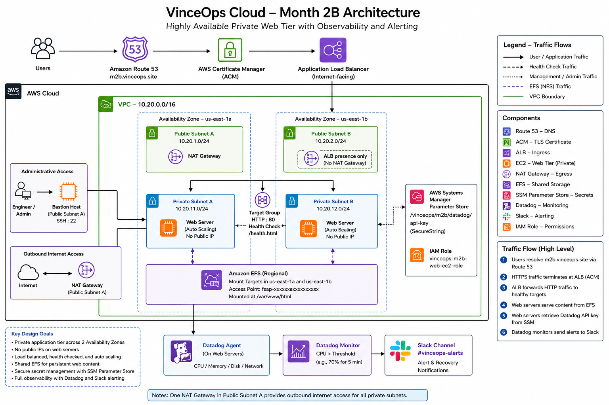

# VinceOps Month 2B Architecture

This diagram represents the Month 2B evolution of the VinceOps AWS environment.

It shows the transition from the earlier single-instance workload into a multi-AZ architecture with private application compute, load-balanced ingress, shared storage, Auto Scaling, secure administration, and operational monitoring.



## Architecture flow

```text
Internet
   ↓
Route 53
   ↓
AWS Certificate Manager
   ↓
Application Load Balancer
   ↓
Private EC2 web tier across two Availability Zones
   ↓
Amazon EFS
```

Administrative access is routed through the bastion host, while operational telemetry flows from the private web tier into Datadog and then into the VinceOps Slack alerting channel.

## Design principles

* Keep public exposure at the edge.
* Keep application compute private.
* Distribute workloads across Availability Zones.
* Treat EC2 instances as replaceable compute.
* Externalise shared application content.
* Use health-aware traffic routing.
* Automate server bootstrap.
* Make infrastructure behaviour observable.

---

[← Month 2B Overview](../README.md) ·
[Engineering Evidence](../evidence/README.md) ·
[Engineering Decisions](../decisions.md) ·
[Troubleshooting](../troubleshooting.md)
