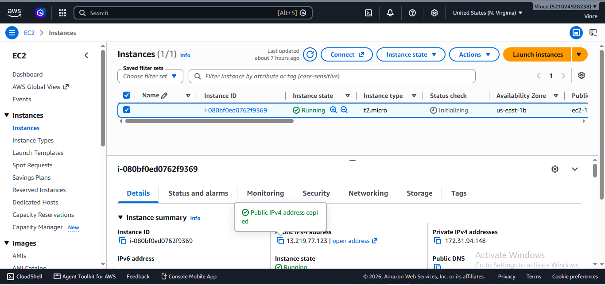
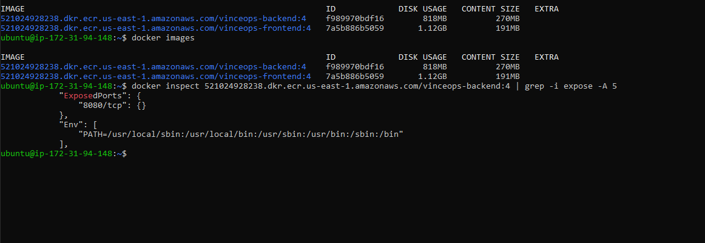
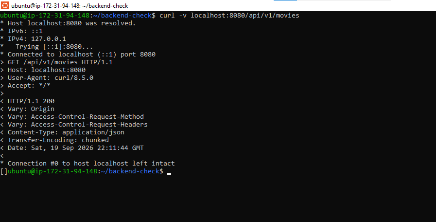
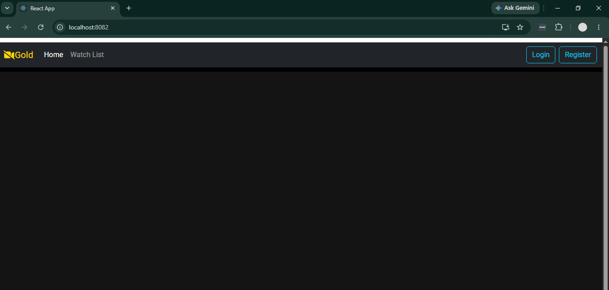
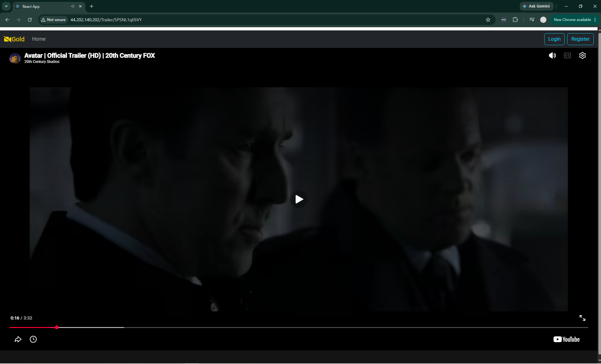

# VinceOps Cloud Deployment Documentation

## Project Overview

VinceOps Cloud is a full-stack movie application deployed on AWS EC2 using Docker containerization.

The deployment includes:

- React frontend
- Spring Boot backend API
- MongoDB database
- Docker containers
- AWS EC2 infrastructure
- Amazon ECR image repository
- GitHub Actions CI workflow

# Architecture

User Browser
|
|
AWS EC2 Instance
|
|
Docker Environment
|
|---- React Frontend Container
|
|---- Spring Boot Backend Container
|
|---- MongoDB Database Container

# Deployment Workflow

## 1. Source Code

The application source code was prepared and organized into frontend and backend services.

## 2. Containerization

Docker images were created for:

- Frontend application
- Backend API

## 3. Image Management

Docker images were tagged and pushed to Amazon Elastic Container Registry (ECR).

## 4. Cloud Deployment

The application was deployed on an AWS EC2 Ubuntu server.

Security group configuration allowed:

- SSH access
- HTTP traffic
- Backend communication

## 5. Database Integration

MongoDB was deployed as a container and connected with the Spring Boot backend.

## 6. Production Verification

The deployment was verified by testing:

- Backend API response
- Frontend accessibility
- Database connection
- Movie data retrieval
- Trailer playback

# Evidence

## Infrastructure

## Docker Deployment

## Backend API

## Frontend Application

## Final Application Test

# Final Result

The production environment successfully connected:

Frontend → Backend API → MongoDB → Movie Data → User Browser

The application was deployed successfully on AWS EC2.
