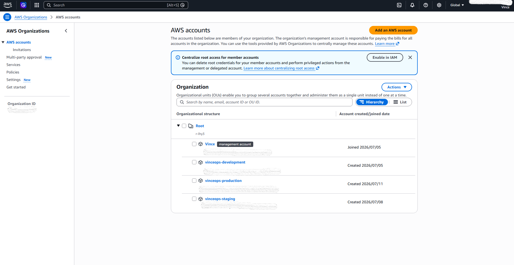

# AWS Organization and Account Structure

## Overview

This section documents the AWS Organizations structure implemented for VinceOps Cloud.

The environment was configured directly in Amazon Web Services. GitHub is used only to present the architecture documentation and sanitized implementation evidence.

## Implemented Account Structure

The AWS Organization contains four accounts:

| AWS Account | Purpose |
|---|---|
| `Vince` | Management account for AWS Organizations, IAM Identity Center, billing, and governance |
| `vinceops-development` | Development and early testing environment |
| `vinceops-staging` | Pre-production validation environment |
| `vinceops-production` | Future Production workload environment |

## Architecture Decision

Separate AWS accounts were used to create stronger boundaries between governance, Development, Staging, and Production.

The Management account is reserved for organization and identity administration. Application workloads are not intended to run in the Management account.

This structure provides a foundation for future:

- environment-specific access control;
- service control policies;
- centralized logging;
- network separation;
- security monitoring;
- account-level billing;
- controlled Production governance.

## Current Structure

All three member accounts currently exist directly beneath the AWS Organizations root.

Organizational units and service control policies were not introduced during this phase because no validated governance policies were ready to be applied.

## Evidence

## Evidence Boundary

The screenshot confirms that the Management, Development, Staging, and Production accounts exist within the AWS Organization.

It does not by itself prove that every cross-account role, trust relationship, or Production access route has been reviewed.
