# Month 2 Implementation Evidence

This directory contains sanitized evidence from the VinceOps Cloud AWS network and secure web deployment.

The screenshots follow the implementation sequence from network creation through EC2 deployment, DNS configuration, Nginx installation, HTTPS enablement, and external security validation.

> Sensitive AWS identifiers, IP addresses, email addresses, SSH details, and personal information have been removed before publication.

## Evidence Summary

| Stage | Evidence |
|---|---|
| Network foundation | Public subnet, route-table association, Internet Gateway route, and VPC Flow Logs |
| Compute deployment | EC2 instance configuration and network attachment |
| Server administration | SSH access and Nginx service validation |
| DNS | Global propagation of `vinceops.site` |
| HTTPS | Certbot installation and Let’s Encrypt certificate deployment |
| Application | Successful deployment of the VinceOps website |
| Security validation | Before-and-after external port-scan results |

---

## 1. Public Subnet

The subnet was created inside the custom VinceOps VPC using the `10.0.1.0/24` IPv4 CIDR range.

[View full-size evidence](./01-public-subnet-created.png)

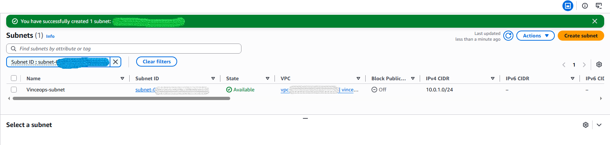

---

## 2. Route-Table and Subnet Association

The VinceOps subnet was explicitly associated with the custom route table.

[View full-size evidence](./02-route-table-subnet-association.png)

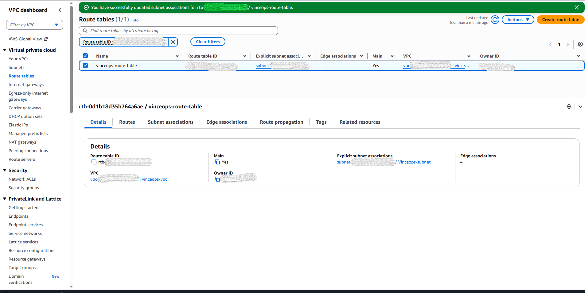

---

## 3. Internet Gateway Route

The public route table includes an active default route:

```text
0.0.0.0/0 → Internet Gateway
```

This route provides the public subnet with an internet path.

[View full-size evidence](./03-public-route-to-internet-gateway.png)

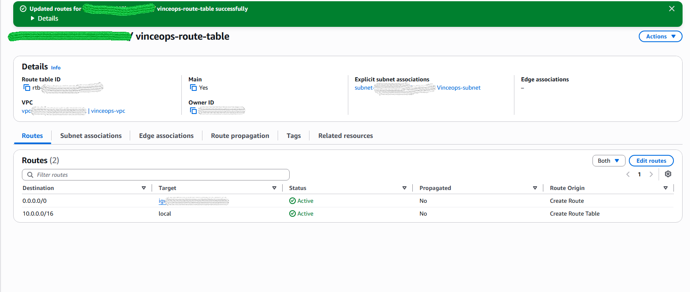

---

## 4. VPC Flow Logs

VPC Flow Logs were enabled for network visibility.

The configuration records all traffic types and sends the log data to the designated Amazon S3 destination.

[View full-size evidence](./04-vpc-flow-logs-active.png)

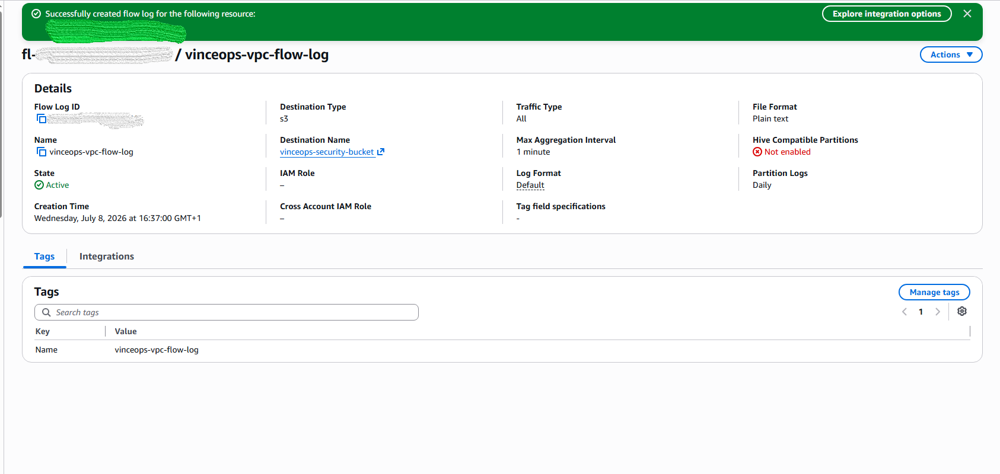

---

## 5. EC2 Instance

An Ubuntu EC2 instance was launched and attached to the custom VPC, public subnet, and security controls.

The implementation used:

- Amazon EC2;
- Ubuntu Linux;
- `t2.medium`;
- a public network interface;
- IMDSv2;
- the custom VinceOps VPC and subnet.

[View full-size evidence](./05-ec2-instance-summary.png)

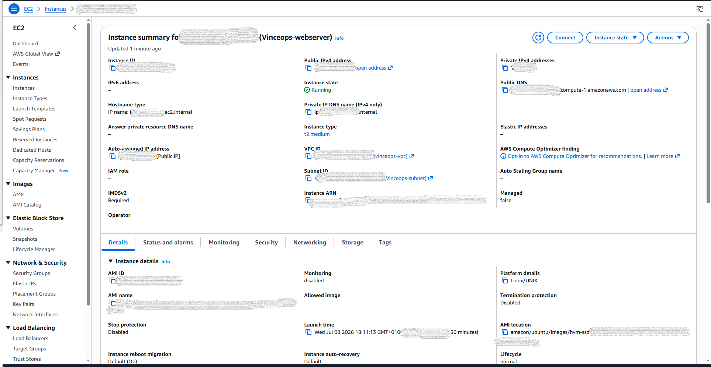

---

## 6. SSH Access

Key-based SSH authentication was used to connect securely to the Ubuntu EC2 instance.

[View full-size evidence](./06-ssh-access-success.png)

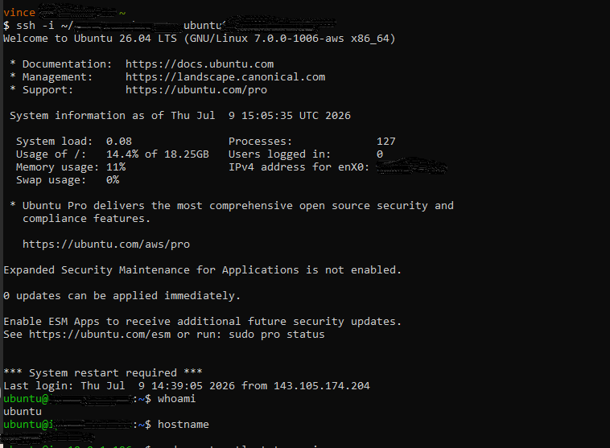

---

## 7. Nginx Service Validation

Nginx was installed, enabled, started, and validated through:

```bash
sudo systemctl status nginx
curl -I http://localhost
```

The service returned a successful HTTP response from the local server.

[View full-size evidence](./07-nginx-active-http-response.png)

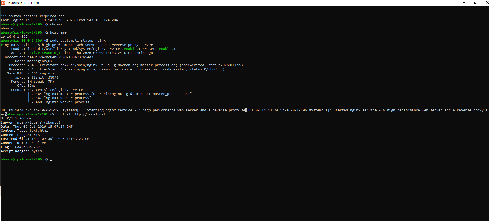

---

## 8. DNS Propagation

The DNS A record for `vinceops.site` was checked across multiple global DNS resolvers.

The evidence shows successful propagation across most tested locations.

[View full-size evidence](./08-dns-propagation-vinceops-site.png)

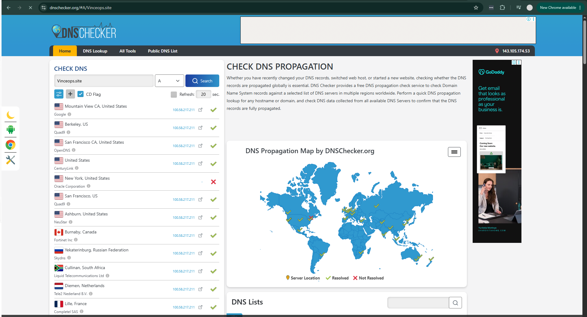

---

## 9. Certbot Installation

Certbot was installed on the Ubuntu server in preparation for Let’s Encrypt certificate issuance.

[View full-size evidence](./09-certbot-installed.png)


---

## 10. HTTPS Certificate Issuance

A Let’s Encrypt certificate was requested and successfully deployed through the Certbot Nginx integration.

[View full-size evidence](./10-certbot-certificate-issued.png)

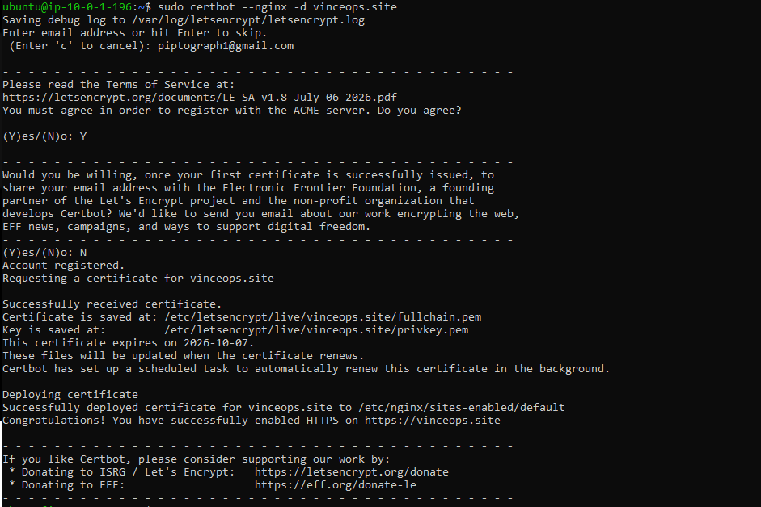

---

## 11. Root and `www` Certificate Coverage

The certificate configuration was expanded to cover both:

```text
vinceops.site
www.vinceops.site
```

This corrected the initial hostname-coverage limitation.

[View full-size evidence](./11-certificate-expanded-root-and-www.png)

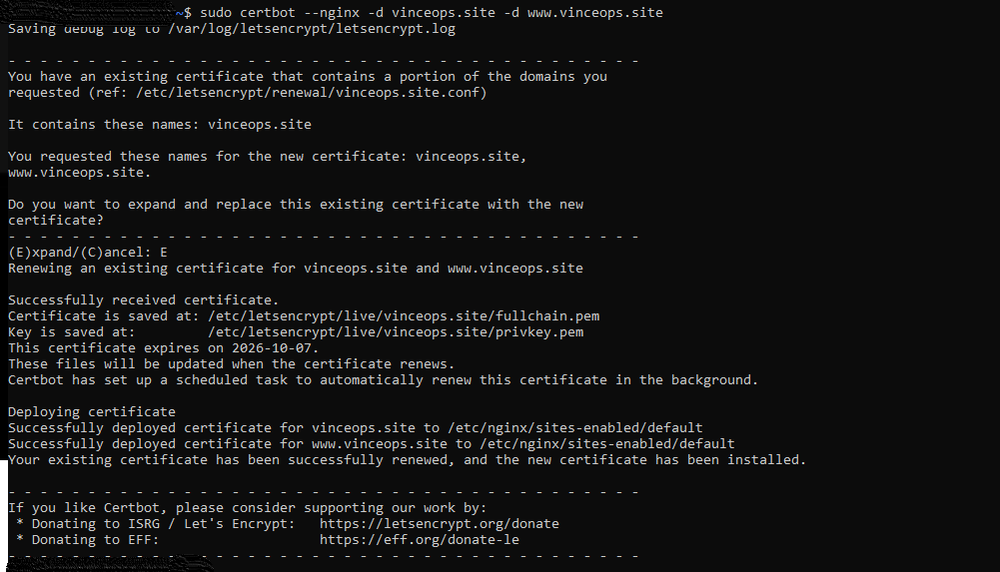

---

## 12. HTTPS Certificate Details

Browser certificate inspection confirmed that the website certificate was issued by Let’s Encrypt for `vinceops.site`.

[View full-size evidence](./12-https-certificate-details.png)


---

## 13. Deployed Website

The customized VinceOps website was successfully served through the configured domain and HTTPS endpoint.

[View full-size evidence](./13-vinceops-site-https-deployed.png)

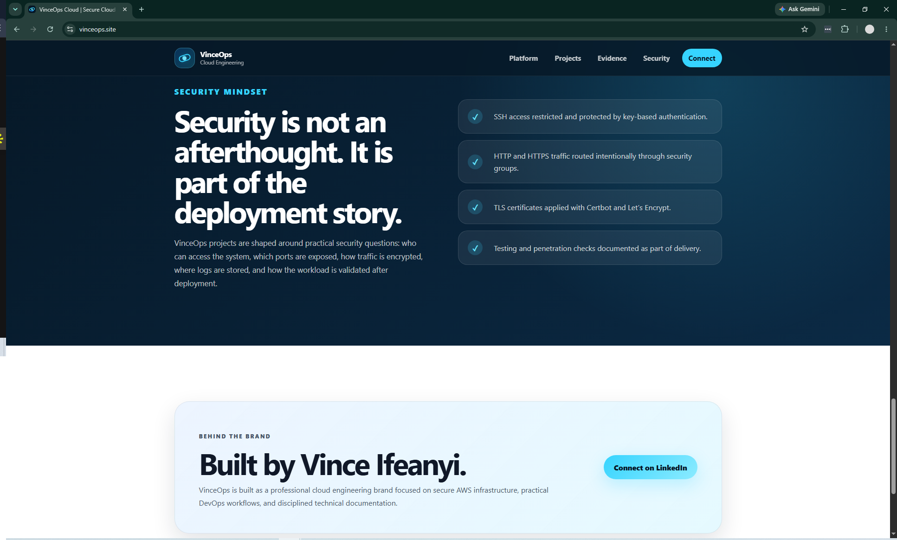

---

## 14. Initial External Port Scan

An authorised light external port scan initially observed:

| Port | Service | Result |
|---:|---|---|
| 80 | HTTP | Open |
| 443 | HTTPS | Open |

[View screenshot evidence](./14-port-scan-before-http-and-https.png)

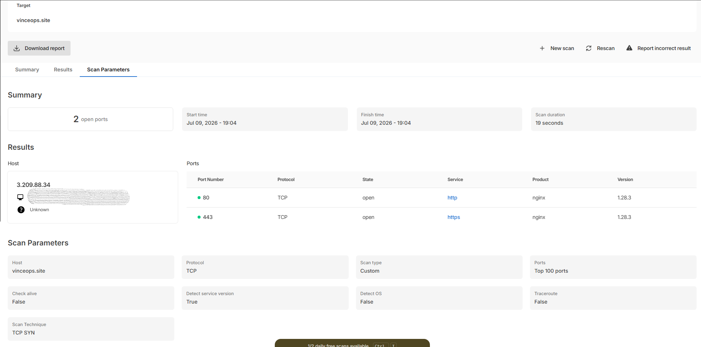

[View the initial PDF report](../security-reports/port-scan-before-http-and-https.pdf)

---

## Follow-Up Security Validation

After the public exposure was reviewed and adjusted, a follow-up light scan observed only:

| Port | Service | Result |
|---:|---|---|
| 443 | HTTPS | Open |

[View the follow-up PDF report](../security-reports/port-scan-after-https-only.pdf)

This was a limited scan of the top 100 ports and is documented as a first-pass external security assessment rather than a complete penetration test.

---

## Evidence Notes

- The screenshots represent a successfully validated point-in-time deployment.
- The EC2 instance was later stopped to control ongoing laboratory costs.
- The external scans were performed only against the project owner’s domain.
- Resource names and relevant configuration states remain visible to support the implementation claims.
- Sensitive identifiers and authentication information were removed before publication.

---

### Navigation

[Back to Month 2 Overview](../README.md) ·
[Architecture Documentation](../network-web-architecture.md) ·
[Security Testing](../security-testing.md) ·
[Technical Decisions](../decisions.md)
