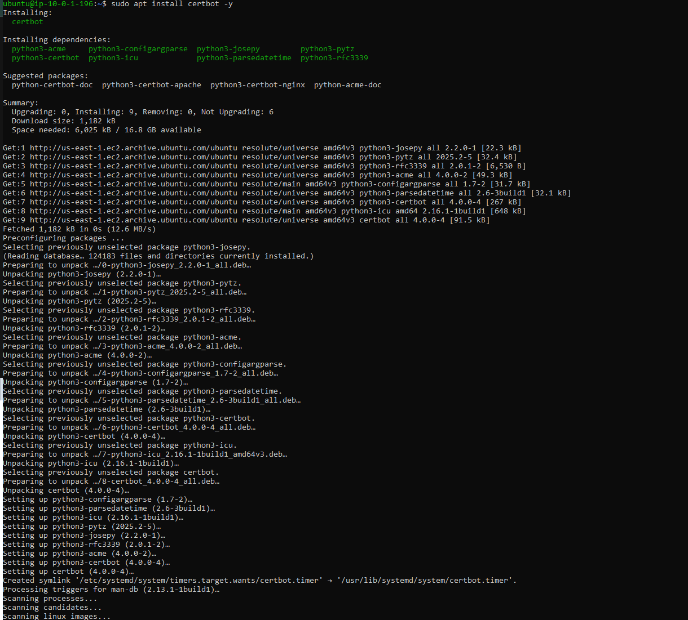
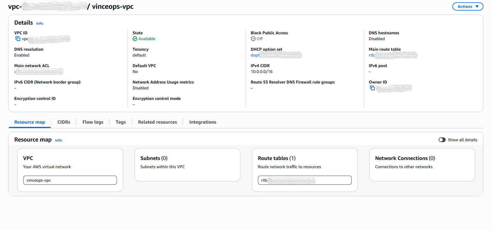
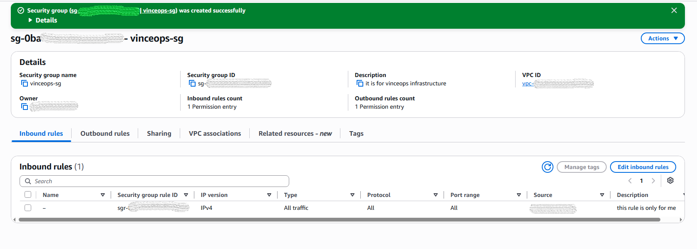
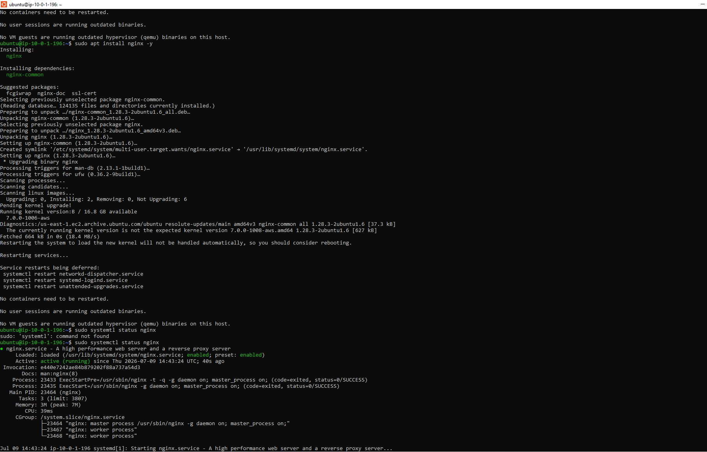
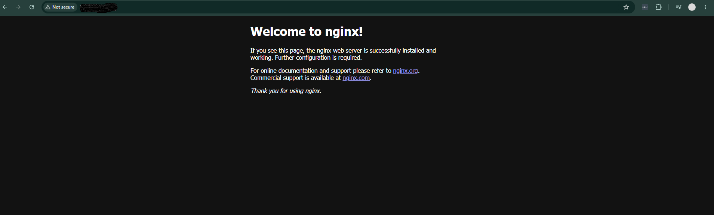

# Month 2 Implementation Evidence

This directory contains selected, sanitized evidence from the VinceOps Cloud AWS network and secure web deployment.

The evidence follows the implementation journey from network creation through EC2 deployment, DNS configuration, Nginx installation, HTTPS enablement, application validation, and external security review.

> Sensitive AWS identifiers, IP addresses, email addresses, SSH information, certificate details, and personal data were removed before publication.

## Evidence Summary

| Stage | Evidence Provided |
|---|---|
| Network foundation | Public subnet, route-table association, Internet Gateway route, and VPC Flow Logs |
| Compute deployment | EC2 instance configuration and network attachment |
| Server administration | SSH access and Nginx service validation |
| DNS | Public propagation of `vinceops.site` |
| HTTPS | Certbot installation and Let’s Encrypt certificate deployment |
| Application | Successful deployment of the VinceOps website |
| Security validation | Before-and-after external port-scan results |

---

## 1. Public Subnet

A public subnet was created inside the custom VinceOps VPC using the following IPv4 CIDR range:

```text
10.0.1.0/24
```

The subnet was used for the internet-facing EC2 web server.

[View full-size evidence](./01-public-subnet-created.png)


---

## 2. Route-Table and Subnet Association

The VinceOps subnet was explicitly associated with the custom route table.

This ensured that the subnet used the intended routing configuration.

[View full-size evidence](./02-route-table-subnet-association.png)


---

## 3. Internet Gateway Route

The public route table contained an active default route:

```text
0.0.0.0/0 → Internet Gateway
```

This provided the public subnet with an internet traffic path.

[View full-size evidence](./03-public-route-to-internet-gateway.png)


---

## 4. VPC Flow Logs

VPC Flow Logs were enabled to provide network traffic metadata for troubleshooting and security review.

The configuration recorded supported network traffic and delivered the Flow Log data to the designated Amazon S3 destination.

[View full-size evidence](./04-vpc-flow-logs-active.png)


---

## 5. EC2 Instance

An Ubuntu EC2 instance was launched and attached to the custom VinceOps network.

The documented configuration included:

- Amazon EC2;
- Ubuntu Linux;
- `t2.medium`;
- the custom VinceOps VPC;
- the project public subnet;
- a public network interface;
- security controls;
- IMDSv2.

[View full-size evidence](./05-ec2-instance-summary.png)


---

## 6. SSH Access

Key-based SSH authentication was used to connect to the Ubuntu EC2 instance for server administration.

Private-key details, IP addresses, usernames, and local system information were removed from the public screenshot.

[View full-size evidence](./06-ssh-access-success.png)


---

## 7. Nginx Service Validation

Nginx was installed, enabled, started, and validated on the EC2 server.

The service was checked using commands including:

```bash
sudo systemctl status nginx
curl -I http://localhost
```

The server returned a successful local HTTP response.

[View full-size evidence](./07-nginx-active-http-response.png)


---

## 8. DNS Propagation

The DNS A record for:

```text
vinceops.site
```

was checked across multiple global DNS resolvers.

The evidence shows that the domain had propagated across the tested DNS locations.

[View full-size evidence](./08-dns-propagation-vinceops-site.png)


---

## 9. Certbot Installation

Certbot was installed on the Ubuntu EC2 server to support automated Let’s Encrypt certificate issuance.

[View full-size evidence](./9-certbot-installed.png)



---

## 10. HTTPS Certificate Issuance

A Let’s Encrypt certificate was requested and successfully deployed through the Certbot Nginx integration.

The successful result confirmed that the certificate was issued for the configured VinceOps domain.

[View full-size evidence](./10-certbot-certificate-issued.png)


---

## 11. Root and `www` Certificate Coverage

The initial certificate configuration was reviewed and expanded to cover both public hostnames:

```text
vinceops.site
www.vinceops.site
```

This corrected the initial hostname-coverage limitation and prevented certificate-name mismatch errors when using the `www` address.

[View full-size evidence](./11-certificate-expanded-root-and-www.png)


---

## 12. HTTPS Certificate Details

Browser certificate inspection confirmed that the website certificate was issued by Let’s Encrypt for the VinceOps domain.

[View full-size evidence](./12-https-certificate-detail.png)


---

## 13. Deployed Website

The customized VinceOps website was successfully served through the configured domain and HTTPS endpoint.

The completed deployment combined:

- public DNS resolution;
- AWS network routing;
- EC2 compute;
- Nginx web serving;
- Let’s Encrypt TLS encryption;
- customized website content.

[View full-size evidence](./13-vinceops-site-https-deployed.png)


---

## 14. Initial External Port Scan

An authorised light external port scan was performed against the self-owned project domain.

The initial scan observed:

| Port | Service | State |
|---:|---|---|
| 80 | HTTP | Open |
| 443 | HTTPS | Open |

[View screenshot evidence](./14-port-scan-before-http-and-https.png)


[View the initial scan report](./%20security-reports/port-scan-before-http-and-https.png)

---

## Follow-Up Security Validation

After reviewing and reducing the publicly exposed services, a follow-up light scan observed:

| Port | Service | State |
|---:|---|---|
| 443 | HTTPS | Open |

[View the follow-up scan report](./%20security-reports/port-scan-after-https-only.png)


### Security Interpretation

The follow-up result demonstrates a reduction in the publicly observed service exposure from HTTP and HTTPS to HTTPS only within the scope of the scan.

The scanner used a limited scan of the top 100 ports. The result is therefore documented as a first-pass external security assessment rather than a complete manual penetration test or proof that the website contained no vulnerabilities.

---

## Supporting Evidence

The following screenshots provide additional context about the implementation journey.

### Initial VPC Overview

This screenshot records the early VPC state before all network resources were reflected in the resource map.

[View supporting evidence](./appendix-01-vpc-overview-initial.png)



### Initial Administrator Security-Group Rule

This screenshot records the initial trusted-IP administrator rule used during the practical deployment.

[View supporting evidence](./appendix-03-initial-admin-security-grou.png)



### Nginx Installation Output

This screenshot records the Ubuntu package update and Nginx installation process.

[View supporting evidence](./appendix-04-nginx-installation-output.png)



### Default Nginx Page

This screenshot confirms that Nginx was reachable before the default content was replaced by the customized VinceOps website.

[View supporting evidence](./appendix-05-nginx-default-page.png)



---

## Evidence Boundary

The evidence in this directory supports a successfully validated point-in-time deployment.

It demonstrates:

- custom AWS network configuration;
- public subnet and internet routing;
- EC2 deployment;
- SSH-based server administration;
- Nginx web-service operation;
- DNS propagation;
- TLS certificate deployment;
- HTTPS website availability;
- initial and follow-up external port scanning.

The evidence does not represent the deployment as a continuously operated production platform or as a complete penetration-tested system.

---

## Deployment Lifecycle

The EC2-hosted website was validated through:

- DNS resolution;
- Nginx service testing;
- HTTPS certificate inspection;
- website functionality checks;
- external security scanning.

After the implementation and evidence collection were completed, the EC2 instance was stopped to control ongoing laboratory costs.

The repository preserves the documented architecture and sanitized point-in-time implementation evidence.

---

## Evidence Security

The public screenshots were reviewed to remove or conceal:

- AWS account and owner IDs;
- resource IDs and ARNs;
- EC2 public and private addresses;
- AWS public hostnames;
- SSH key names and paths;
- local usernames;
- Certbot registration email addresses;
- certificate fingerprints;
- authentication information;
- unrelated browser and desktop details.

Relevant resource names, configuration states, domain names, port numbers, and service results remain visible because they support the documented implementation.

---

### Navigation

[Back to Month 2 Overview](../README.md) ·
[Architecture Documentation](../network-web-architecture.md) ·
[Security Testing](../security-testing.md) ·
[Technical Decisions](../decisions.md) ·
[Serverless Bonus](../serverless-bonus.md)
