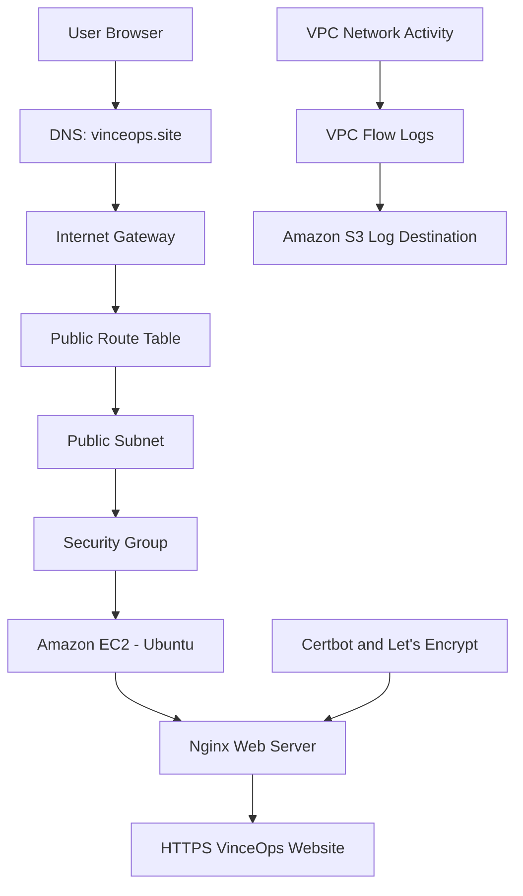

# Month 2: AWS Network and Secure Web Deployment


> **An evidence-driven AWS web deployment built from a custom VPC foundation through EC2, DNS, Nginx, HTTPS, functional validation, and external security review.**

[](https://www.vinceops.site/)

---

## Project Overview

Month 2 of VinceOps Cloud focused on deploying a public web application through a deliberately configured AWS network path.

The implementation began with a custom Amazon VPC and progressed through:

- public subnet configuration;
- internet routing;
- security controls;
- EC2 deployment;
- SSH-based server administration;
- Nginx installation;
- website file deployment;
- DNS mapping;
- HTTPS certificate installation;
- functional testing;
- network logging;
- authorised external port scanning.

The infrastructure was configured directly in AWS. This repository contains the architecture documentation, technical decisions, testing notes, and sanitized implementation evidence.

The original EC2-hosted deployment was stopped after successful validation and evidence collection to control ongoing laboratory costs.

---

## Project Objective

The objective was to build and document the complete request path from a user’s browser to an HTTPS-enabled website hosted on AWS.

A public website requires more than launching a virtual machine. The deployment needed:

- an isolated AWS network boundary;
- an intentional route from the internet to the workload;
- controlled administrative and web access;
- a configured compute instance;
- a working web server;
- a human-readable domain;
- encrypted HTTPS communication;
- network visibility;
- functional validation;
- security exposure review.

---

## What I Implemented

### AWS Networking

- Dedicated custom Amazon VPC
- Public subnet for the internet-facing workload
- Internet Gateway attached to the VPC
- Public route table
- Active default route to the Internet Gateway
- Explicit subnet-to-route-table association
- Security-group controls
- VPC Flow Logs
- Amazon S3 destination for Flow Log data

### Compute and Administration

- Ubuntu-based Amazon EC2 instance
- `t2.medium` instance type
- 20 GB root storage
- Custom VPC and public-subnet attachment
- Public network interface for the lab deployment
- IMDSv2
- SSH key-pair authentication
- Remote administration through MobaXterm

### Web Deployment

- Ubuntu package update and preparation
- Nginx installation and service enablement
- Customized website file upload
- Website deployment to `/var/www/html`
- Nginx service-status validation
- Local HTTP-response validation
- DNS A-record configuration
- DNS propagation checking

### HTTPS and Testing

- Certbot installation
- Certbot Nginx integration
- Let’s Encrypt certificate issuance
- Certificate coverage for:
  - `vinceops.site`
  - `www.vinceops.site`
- HTTPS browser validation
- Nginx response testing
- Authorised light external port scanning
- Before-and-after exposure comparison

### Additional Exercise

- Brief serverless web-hosting exercise documented separately

---

## Explore the Documentation

| Documentation | Description |
|---|---|
| [Network and Web Architecture](./network-web-architecture.md) | Detailed implementation from the VPC foundation to the HTTPS website |
| [Architecture and Technical Decisions](./decisions.md) | Design reasoning, trade-offs, consequences, and improvement opportunities |
| [Security Testing Notes](./security-testing.md) | External scan scope, observed exposure, and remediation notes |
| [Serverless Hosting Bonus](./serverless-bonus.md) | Brief documentation of the additional hosting exercise |
| [Screenshot Evidence Register](./%20screenshots/README.md) | Sanitized AWS, terminal, DNS, browser, and security-testing evidence |

---

## Deployment Architecture



### Primary Request Path

```text
User Browser
      │
      ▼
vinceops.site
DNS A Record
      │
      ▼
Internet Gateway
      │
      ▼
Public Route Table
0.0.0.0/0 → Internet Gateway
      │
      ▼
Public Subnet
      │
      ▼
Security Group
      │
      ▼
Amazon EC2
Ubuntu Linux
      │
      ▼
Nginx
/var/www/html
      │
      ▼
VinceOps Website
HTTPS Enabled
```

### Network-Logging Path

```text
VPC Network Activity
        │
        ▼
VPC Flow Logs
        │
        ▼
Amazon S3 Destination
```

### TLS Configuration Path

```text
vinceops.site
www.vinceops.site
        │
        ▼
Certbot
        │
        ▼
Let's Encrypt
        │
        ▼
Nginx HTTPS Configuration
```

---

## Network Foundation

A custom VPC was used instead of relying on the default AWS network.

| Component | Responsibility |
|---|---|
| Custom VPC | Provides the project network boundary |
| Public subnet | Hosts the internet-facing EC2 instance |
| Internet Gateway | Connects the VPC to the public internet |
| Route table | Directs `0.0.0.0/0` traffic to the Internet Gateway |
| Security group | Controls traffic reaching the EC2 instance |
| VPC Flow Logs | Captures supported network traffic metadata |
| Amazon S3 | Receives the configured Flow Log data |

The public subnet used the IPv4 CIDR range:

```text
10.0.1.0/24
```

It was explicitly associated with the route table containing the Internet Gateway route.

### Network Evidence

- [Public subnet created](./%20screenshots/01-public-subnet-created.png)
- [Route-table and subnet association](./%20screenshots/02-route-table-subnet-association.png)
- [Internet Gateway route](./%20screenshots/03-public-route-to-internet-gateway.png)
- [VPC Flow Logs active](./%20screenshots/04-vpc-flow-logs-active.png)

---

## EC2 Compute Deployment

An Ubuntu EC2 instance was launched inside the custom network.

| Setting | Implementation |
|---|---|
| Cloud service | Amazon EC2 |
| Operating system | Ubuntu Linux |
| Instance type | `t2.medium` |
| Storage | 20 GB |
| Network | Custom VinceOps VPC |
| Subnet | Public subnet |
| Public access | Enabled for the lab deployment |
| Administration | SSH key-pair authentication |
| Web server | Nginx |
| Metadata protection | IMDSv2 |

The EC2 public address was used for the initial DNS mapping.

### Compute Evidence

[View the EC2 instance summary](./%20screenshots/05-ec2-instance-summary.png)


---

## Secure Server Administration

Key-based SSH authentication was used to access and configure the Ubuntu instance.

The server was prepared using commands such as:

```bash
sudo apt update -y
sudo apt upgrade -y
```

Passwords were not used for the documented server login.

Sensitive information—including the private-key filename, local username, server address, and login details—was removed from the public evidence.

### SSH Evidence

[View SSH access evidence](./%20screenshots/06-ssh-access-success.png)

---

## Nginx Web Service

Nginx was installed on the Ubuntu server:

```bash
sudo apt install nginx -y
```

The service was enabled and started:

```bash
sudo systemctl enable nginx
sudo systemctl start nginx
```

The service status was checked:

```bash
sudo systemctl status nginx
```

A local response test was performed:

```bash
curl -I http://localhost
```

The customized website files were served from:

```text
/var/www/html
```

### Nginx Evidence

[View Nginx service validation](./%20screenshots/07-nginx-active-http-response.png)

---

## Application File Deployment

The customized website files were transferred to the EC2 server through MobaXterm using SSH and SFTP.

A working directory was prepared on the server:

```bash
mkdir webcontent
cd webcontent
```

The uploaded archive was extracted:

```bash
sudo apt install unzip -y
unzip application.zip
ls -la
```

The default Nginx content was removed before the customized application files were placed in the web root:

```bash
sudo rm -rf /var/www/html/index*
```

The project files were copied into:

```text
/var/www/html
```

---

## DNS Configuration

A DNS A record was configured for:

```text
vinceops.site
```

At the time of the EC2 deployment, the record pointed to the public address of the web server.

```text
vinceops.site
      │
      ▼
EC2 Public Address
```

DNS propagation was checked across multiple global resolvers before HTTPS certificate issuance.

### DNS Evidence

[View DNS propagation evidence](./%20screenshots/08-dns-propagation-vinceops-site.png)

---

## HTTPS and TLS

Certbot and the Nginx integration were installed:

```bash
sudo apt install certbot -y
sudo apt install python3-certbot-nginx -y
```

The Nginx configuration was tested:

```bash
sudo nginx -t
```

A Let’s Encrypt certificate was requested for the root domain:

```bash
sudo certbot --nginx -d vinceops.site
```

The certificate configuration was then expanded to cover both hostnames:

```bash
sudo certbot --nginx -d vinceops.site -d www.vinceops.site
```

Certificate renewal was also tested:

```bash
sudo certbot renew --dry-run
```

### HTTPS Evidence

- [Certbot installed](./%20screenshots/9-certbot-installed.png)
- [Certificate issued](./%20screenshots/10-certbot-certificate-issued.png)
- [Root and `www` coverage](./%20screenshots/11-certificate-expanded-root-and-www.png)
- [Certificate details](./%20screenshots/12-https-certificate-detail.png)

---

## Website Deployment Result

The customized VinceOps website was successfully served through the configured HTTPS domain.

```text
https://vinceops.site
```

The completed deployment combined:

- DNS resolution;
- AWS internet routing;
- EC2 compute;
- Nginx web serving;
- Let’s Encrypt TLS encryption;
- customized website content.

### Website Evidence

[View the deployed VinceOps website evidence](./%20screenshots/13-vinceops-site-https-deployed.png)


---

## Functional Validation

The implementation was validated through:

- successful DNS resolution;
- successful HTTPS loading;
- homepage availability;
- correct certificate presentation;
- static-content loading;
- Nginx service status;
- local HTTP response;
- server resource checks;
- external service-exposure scanning.

Useful validation commands included:

```bash
curl -I https://vinceops.site

sudo tail -n 50 /var/log/nginx/access.log
sudo tail -n 50 /var/log/nginx/error.log

df -h
free -m
```

---

## External Security Validation

An authorised light external port scan was performed against the self-owned project domain.

The scan was a limited first-pass assessment of the top 100 ports. It was not treated as a complete manual penetration test.

### Initial Observation

The initial scan observed:

| Port | Service | State |
|---:|---|---|
| 80 | HTTP | Open |
| 443 | HTTPS | Open |

[View the initial scan screenshot](./%20screenshots/14-port-scan-before-http-and-https.png)

[View the initial report image](./%20screenshots/%20security-reports/port-scan-before-http-and-https.png)

### Follow-Up Observation

After the exposed services were reviewed and adjusted, the follow-up light scan observed:

| Port | Service | State |
|---:|---|---|
| 443 | HTTPS | Open |

[View the follow-up report image](./%20screenshots/%20security-reports/port-scan-after-https-only.png)

### Interpretation

Within the limited scope of the scan, the publicly observed exposure was reduced from HTTP and HTTPS to HTTPS only.

This result does not prove that every possible port was closed or that the website contained no vulnerabilities.

[Read the complete security-testing notes](./security-testing.md)

---

## Implementation Evidence

The final evidence set follows the actual filenames stored in the repository.

| Evidence Area | Available Files |
|---|---|
| Network foundation | `01–04` |
| EC2 compute | `05` |
| Server administration | `06–07` |
| DNS propagation | `08` |
| Certbot and HTTPS | `9–12` |
| Deployed website | `13` |
| Initial external scan | `14` |
| Follow-up external scan | ` security-reports/` |
| Supporting evidence | `appendix-*` |

[Review the complete screenshot evidence register](./%20screenshots/README.md)

### Information Removed Before Publication

The public evidence was reviewed to conceal:

- AWS account and Owner IDs;
- resource IDs and ARNs;
- public and private IP addresses;
- AWS public hostnames;
- SSH key names and paths;
- local usernames;
- Certbot registration email addresses;
- certificate fingerprints;
- authentication details;
- unrelated browser and desktop information.

Relevant domain names, resource names, configuration states, port numbers, and service results remain visible where they support the implementation claims.

---

## Key Technical Decisions

### Custom VPC Before Compute

The network boundary was created before EC2 so that the server could be launched inside an intentionally designed subnet and routing environment.

### Public Subnet for the Web Workload

The EC2 instance was placed in a public subnet because the project required direct public web access during the deployment exercise.

### Explicit Route-Table Association

The public subnet was explicitly associated with the intended route table rather than relying on an assumed association.

### Direct DNS-to-EC2 Mapping

The domain was mapped directly to the EC2 public address to keep the learning architecture simple and transparent.

For a longer-running environment, a stable entry point such as an Elastic IP or load balancer could be considered.

### Nginx as the Web Server

Nginx was selected as a lightweight web server for serving the customized static website files.

### HTTPS Before Completion

The project was not considered complete until the exact public domain loaded successfully through HTTPS.

### Network Logging

VPC Flow Logs were enabled and configured with an Amazon S3 destination to provide traffic metadata for troubleshooting and review.

### Evidence-Based Validation

The project was tested from the user and server perspectives rather than assuming that successfully created AWS resources automatically resulted in a functioning deployment.

---

## Deployment Lifecycle

The EC2-hosted deployment was validated through:

- DNS resolution;
- Nginx service testing;
- HTTPS certificate inspection;
- website functionality checks;
- external port scanning.

After implementation and evidence collection were completed, the EC2 instance was stopped to control ongoing laboratory costs.

This repository therefore documents a successfully completed point-in-time EC2 deployment rather than presenting the EC2 workload as a continuously running production system.

The serverless exercise is documented separately and is not represented as part of the primary EC2 architecture.

---

## Outcome

Month 2 produced a successfully validated AWS web deployment with:

- a dedicated network foundation;
- intentional internet routing;
- EC2 compute;
- key-based server administration;
- an operational Nginx web service;
- a custom domain;
- Let’s Encrypt HTTPS;
- network traffic logging;
- functional testing evidence;
- external exposure review;
- organized and sanitized implementation documentation.

The project demonstrates the complete practical path from AWS network creation to a documented HTTPS web deployment.

---

## Repository Navigation

[⬆ Back to top](#month-2-aws-network-and-secure-web-deployment) ·
[Architecture](./network-web-architecture.md) ·
[Decisions](./decisions.md) ·
[Security Testing](./security-testing.md) ·
[Serverless Bonus](./serverless-bonus.md) ·
[Evidence](./%20screenshots/README.md) ·
[Website](https://www.vinceops.site/)
