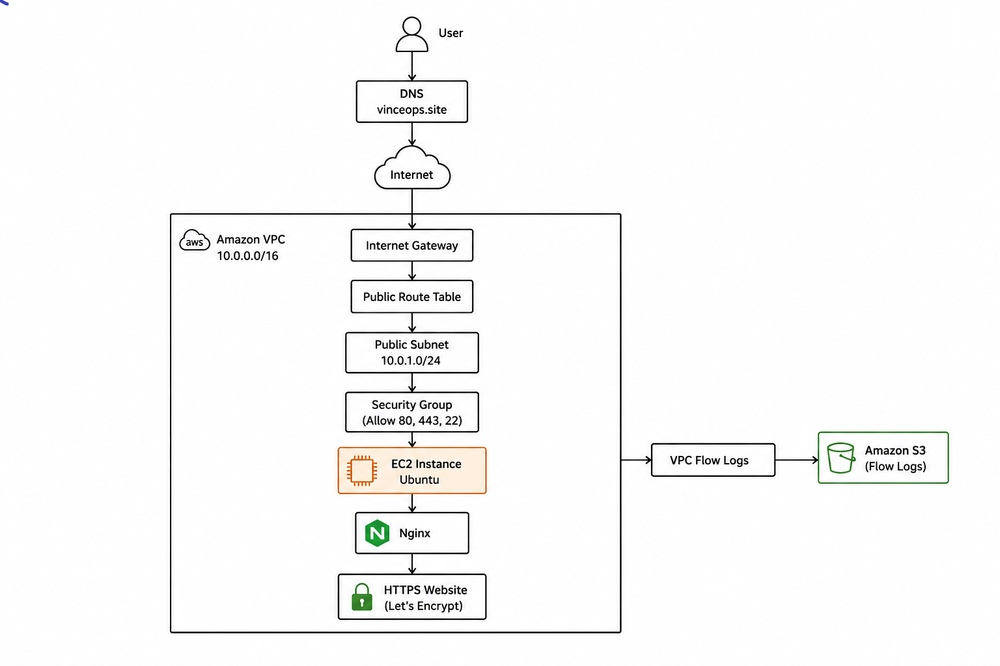

# Month 2: AWS Network and Secure Web Deployment


> **A public AWS web deployment built from a custom VPC foundation through EC2, DNS, Nginx, HTTPS, testing, and security assessment.**

[](https://project-one.smartcloud9.online)

## Project Overview

Month 2 of VinceOps Cloud focused on deploying a public web application through a controlled AWS network path.

The project began with a custom VPC and progressed through subnet configuration, internet routing, EC2 deployment, domain mapping, application file transfer, Nginx configuration, TLS certificate installation, functional testing, and an authorised external security scan.

The infrastructure was configured directly in AWS. GitHub is used to document the architecture, technical decisions, commands, testing results, and sanitized implementation evidence.

## The Problem

A public website requires more than launching a virtual machine and copying files onto it.

The deployment needed:

- an isolated AWS network boundary;
- a controlled path from the internet to the web server;
- defined security-group rules;
- a running compute instance;
- a human-readable domain;
- a reliable web service;
- encrypted HTTPS communication;
- network logging;
- functional validation;
- an initial external security assessment.

The objective was to build and document the complete path from a browser request to a secure website hosted on AWS.

## What I Implemented

- A dedicated custom Amazon VPC
- A public subnet for the internet-facing web server
- An Internet Gateway attached to the VPC
- A public route table with an internet route
- Subnet association with the public route table
- A web security group for SSH, HTTP, and HTTPS access
- VPC Flow Logs for network activity evidence
- A private Amazon S3 bucket for flow-log storage
- An Amazon EC2 instance attached to the custom network
- A public IP address for web and administrative access
- SSH key-pair authentication
- A 20 GB EC2 root volume
- A DNS A record pointing the project domain to the EC2 instance
- Application file transfer through MobaXterm
- Nginx installation and web-root configuration
- HTTPS using Certbot and Let’s Encrypt
- Functional application testing
- Nginx access and error-log review
- An authorised first-pass external security scan
- A separate bonus serverless web-hosting exercise

## Explore the Documentation

| Documentation | Description |
|---|---|
| [Network and Web Architecture](./network-web-architecture.md) | Detailed implementation from VPC foundation to HTTPS deployment |
| [Architecture and Technical Decisions](./decisions.md) | Design reasoning, trade-offs, consequences, and review triggers |
| [Security Testing Notes](./security-testing.md) | External scan scope, findings, and remediation notes |
| [Serverless Hosting Bonus](./serverless-bonus.md) | Brief documentation of the additional serverless deployment |
| [Screenshot Evidence Register](./screenshots/README.md) | Sanitized AWS, terminal, DNS, browser, and testing evidence |
| [Full Architecture Diagram](./diagrams/network-web-architecture.png) | Visual representation of the implemented deployment path |

## Architecture Diagram

The architecture follows a direct network path from the project domain to an Nginx web server hosted on Amazon EC2.

[View the full-size architecture diagram](./diagrams/network-web-architecture.png)

[](./diagrams/network-web-architecture.png)

## Deployment Architecture

```text
User Browser
      │
      ▼
DNS A Record
      │
      ▼
Internet Gateway
      │
      ▼
Public Route Table
      │
      ▼
Public Subnet
      │
      ▼
Security Group
      │
      ▼
Amazon EC2
      │
      ▼
Nginx Web Server
      │
      ▼
Deployed Website
```

Supporting controls:

```text
VPC Network Activity
        │
        ▼
VPC Flow Logs
        │
        ▼
Private S3 Bucket
```

```text
Project Domain
      │
      ▼
Certbot + Let's Encrypt
      │
      ▼
HTTPS Certificate on Nginx
```

## Network Foundation

A dedicated VPC was created for the web deployment rather than relying on the default AWS network.

The network includes:

| Component | Responsibility |
|---|---|
| VPC | Provides the isolated network boundary |
| Public subnet | Hosts the internet-facing EC2 instance |
| Internet Gateway | Connects the VPC to the public internet |
| Route table | Directs `0.0.0.0/0` traffic to the Internet Gateway |
| Security group | Controls inbound traffic to the EC2 instance |
| VPC Flow Logs | Records network traffic metadata |
| S3 bucket | Stores the flow-log evidence privately |

The public subnet was explicitly associated with the route table containing the Internet Gateway route.

## Security-Group Design

The web server security group was configured to support public web traffic and controlled administration.

| Port | Protocol | Purpose |
|---:|---|---|
| 22 | SSH | Administrative access |
| 80 | HTTP | Web access and certificate validation |
| 443 | HTTPS | Encrypted public web access |

SSH access should remain restricted to the administrator’s trusted IP address rather than being permanently exposed to the entire internet.

## EC2 Compute Deployment

The website runs on an Ubuntu-based Amazon EC2 instance attached to the custom VPC, public subnet, and web security group.

| Setting | Implementation |
|---|---|
| Compute | Amazon EC2 |
| Operating system | Ubuntu |
| Instance family | `t2.micro` or `t2.medium` |
| Storage | 20 GB |
| Public IP | Enabled for the lab deployment |
| Authentication | SSH key pair |
| Web service | Nginx |

The EC2 public IP was used for the initial DNS mapping.

## DNS Configuration

A DNS A record was created to map the project domain to the EC2 public IP address.

```text
project-one.smartcloud9.online
                │
                ▼
        EC2 Public IP Address
```

DNS propagation was verified before requesting the TLS certificate.

The domain used in the certificate request must match the exact hostname users visit.

## Application Deployment

A customized web template was prepared locally and transferred to the EC2 instance through MobaXterm using SSH and SFTP.

A dedicated deployment folder was created:

```bash
mkdir webcontent
cd webcontent
```

The uploaded archive was extracted on the server:

```bash
sudo apt install unzip -y
unzip application.zip
ls -la
```

The extracted files were reviewed before being copied into the Nginx web root.

## Nginx Web Service

Nginx was installed and configured to serve the uploaded application from:

```text
/var/www/html
```

Core commands used during deployment:

```bash
sudo apt update -y
sudo apt upgrade -y
sudo apt install nginx -y

sudo systemctl enable nginx
sudo systemctl start nginx
systemctl status nginx
```

The default Nginx page was removed:

```bash
sudo rm -rf /var/www/html/index*
```

The project files were then copied into the web root:

```bash
sudo cp -rf webcontent/foldername/* /var/www/html/
```

The deployment was verified through the server IP and project domain.

## HTTPS and TLS

Certbot and the Certbot Nginx plugin were installed to automate certificate issuance and Nginx HTTPS configuration.

```bash
sudo apt install certbot -y
sudo apt install python3-certbot-nginx -y
sudo nginx -t
```

A Let’s Encrypt certificate was requested for the project domain:

```bash
sudo certbot --nginx -d project-one.smartcloud9.online
```

The resulting deployment supports encrypted HTTPS access.

Certificate renewal was also tested:

```bash
sudo certbot renew --dry-run
```

## Application Testing

The completed deployment was tested through the HTTPS domain.

Testing covered:

- successful HTTPS loading;
- homepage availability;
- static asset loading;
- page and link behaviour;
- desktop and mobile presentation;
- Nginx access-log review;
- Nginx error-log review;
- basic server resource checks.

Useful validation commands included:

```bash
curl -I https://project-one.smartcloud9.online

sudo tail -n 50 /var/log/nginx/access.log
sudo tail -n 50 /var/log/nginx/error.log

df -h
free -m
```

## Security Assessment

An authorised external scan was performed against the self-owned project domain.

The scan was treated as a first-pass security assessment rather than a complete manual penetration test.

The testing process included:

- confirming ownership and authorisation;
- scanning only the project domain;
- reviewing the scan summary;
- recording identified findings;
- classifying remediation status;
- avoiding publication of sensitive exploit details.

[Review the security testing notes](./security-testing.md)

## Bonus: Serverless Web Hosting

As an additional exercise, I also deployed a website using a serverless hosting approach.

This bonus project demonstrates an alternative to maintaining an EC2 instance and Nginx web server. It is documented separately because it is not part of the primary EC2 network-to-HTTPS architecture.

[View the serverless hosting bonus](./serverless-bonus.md)

## Implementation Evidence

The repository contains sanitized evidence covering the full deployment sequence:

| Evidence Area | Screenshot Range |
|---|---|
| VPC and network foundation | `01–07` |
| EC2 compute | `08–09` |
| DNS configuration | `10–11` |
| Application file transfer | `12–13` |
| Nginx deployment | `14–16` |
| TLS and HTTPS | `17–20` |
| Functional testing | `21–22` |
| External security assessment | `23–24` |
| Serverless bonus | `bonus-01–02` |

[Review the screenshot evidence register](./screenshots/README.md)

Sensitive information was removed before publication, including:

- AWS account IDs;
- account email addresses;
- private IP or registrar information where appropriate;
- local computer usernames;
- SSH key paths;
- private keys;
- certificate account information;
- browser bookmarks and unrelated tabs;
- passwords, secrets, and access tokens.

## Key Technical Decisions

### Custom VPC Before Compute

The network boundary was built before launching EC2 so that the server could be attached to an intentionally designed subnet, route table, Internet Gateway, and security group.

### Public Subnet for the Web Server

The EC2 instance was placed in a public subnet because the project serves a public website directly from the instance.

### Direct DNS-to-EC2 Mapping

The domain was mapped directly to the EC2 public IP to keep the practical deployment simple and understandable.

### Nginx as the Web Server

Nginx was selected as a lightweight and widely used web service for serving the static application files.

### HTTPS Before Public Completion

The project was not treated as complete until the exact public domain loaded successfully through HTTPS.

### Network Logging

VPC Flow Logs were enabled and directed to a private S3 bucket to provide network-level troubleshooting and security evidence.

### Testing Beyond Resource Creation

The project was tested from the user perspective and through Nginx logs rather than assuming that successfully created AWS resources guaranteed a functioning application.

## Outcome

This milestone produced a functioning public AWS web deployment with:

- a dedicated network foundation;
- controlled internet routing;
- an EC2 compute layer;
- a custom domain;
- an operational Nginx web service;
- encrypted HTTPS access;
- network activity logging;
- functional testing evidence;
- an initial external security assessment.

The project demonstrates the full path from infrastructure creation to a live, user-accessible website.

---

### Repository Navigation

[⬆ Back to top](#month-2-aws-network-and-secure-web-deployment) ·
[Architecture](./network-web-architecture.md) ·
[Decisions](./decisions.md) ·
[Security Testing](./security-testing.md) ·
[Serverless Bonus](./serverless-bonus.md) ·
[Evidence](./screenshots/README.md) ·
[Live Site](https://project-one.smartcloud9.online)
