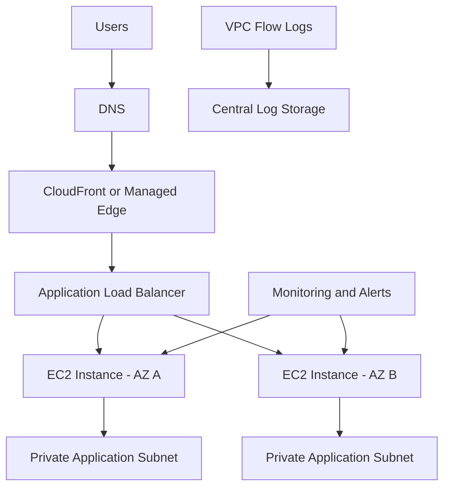

# Month 2 Architecture and Technical Decisions


## Overview

This document records the principal architecture and implementation decisions made during the VinceOps Cloud Month 2 AWS network and secure web-deployment project.

The purpose is to explain:

- what was implemented;
- why each approach was selected;
- the practical trade-offs involved;
- the limitations of the retained evidence;
- how the architecture could be improved for a longer-running environment.

The primary implementation used:

- a custom Amazon VPC;
- a public subnet;
- an Internet Gateway;
- a public route table;
- an Ubuntu Amazon EC2 instance;
- key-based SSH access;
- Nginx;
- DNS mapping for `vinceops.site`;
- Certbot and Let’s Encrypt;
- VPC Flow Logs with an Amazon S3 destination;
- authorised external port scanning.

The EC2 deployment was stopped after successful validation and evidence collection to control ongoing laboratory costs.

---

# Decision Summary

| ID | Decision | Status |
|---|---|---|
| ADR-01 | Use a custom VPC instead of the default VPC | Implemented |
| ADR-02 | Place the EC2 web server in a public subnet | Implemented |
| ADR-03 | Explicitly associate the subnet with a public route table | Implemented |
| ADR-04 | Use an Internet Gateway for public connectivity | Implemented |
| ADR-05 | Host the website on an Ubuntu EC2 instance | Implemented |
| ADR-06 | Use key-based SSH administration | Implemented |
| ADR-07 | Use Nginx as the web server | Implemented |
| ADR-08 | Map the domain directly to the EC2 public address | Implemented |
| ADR-09 | Enable HTTPS using Certbot and Let’s Encrypt | Implemented |
| ADR-10 | Cover both root and `www` hostnames | Implemented |
| ADR-11 | Enable VPC Flow Logs with an S3 destination | Implemented |
| ADR-12 | Perform external exposure validation | Implemented |
| ADR-13 | Reduce observed exposure to HTTPS only | Validated |
| ADR-14 | Sanitize evidence before publication | Implemented |
| ADR-15 | Stop the EC2 instance after validation | Implemented |
| ADR-16 | Keep the serverless exercise separate | Implemented |

---

# ADR-01: Use a Custom VPC

## Context

The project required a clear understanding of how internet traffic reaches a workload hosted on AWS.

Using the default VPC would have reduced the amount of network configuration required, but it would also have hidden important architectural decisions behind existing AWS defaults.

## Decision

Create and use a dedicated VinceOps VPC for the deployment.

## Rationale

A custom VPC made the following components explicit:

- network boundary;
- subnet design;
- route-table configuration;
- Internet Gateway attachment;
- security controls;
- EC2 network placement;
- Flow Log configuration.

## Benefits

- Demonstrates intentional AWS network design.
- Avoids depending on an existing default network.
- Makes the traffic path easier to document.
- Provides clearer evidence of implementation choices.
- Creates a better foundation for future network expansion.

## Trade-Offs

- Requires additional configuration.
- Introduces more opportunities for routing mistakes.
- Requires validation of subnet and route-table associations.

## Future Improvement

A larger architecture could divide the VPC into:

- public subnets;
- private application subnets;
- private data subnets;
- multiple Availability Zones.

---

# ADR-02: Place the Web Server in a Public Subnet

## Context

The website needed to be reachable directly from the public internet during the practical deployment.

## Decision

Place the Ubuntu EC2 web server in a public subnet.

The subnet used:

```text
10.0.1.0/24
```

## Rationale

A public subnet provided a direct and understandable path between the internet and the EC2-hosted website.

This was appropriate for a controlled learning deployment where the purpose was to demonstrate the complete path from network creation to public HTTPS access.

## Benefits

- Simplified the practical deployment.
- Made direct DNS-to-EC2 mapping possible.
- Allowed the Nginx service to be tested publicly.
- Reduced the number of supporting AWS services required.

## Trade-Offs

- The EC2 instance had a public network presence.
- Network access controls required careful review.
- The architecture has less separation than a private-subnet design.
- The server itself handled public web traffic directly.

## Future Improvement

A more resilient architecture could use:

```text
Internet
   │
   ▼
Application Load Balancer
   │
   ▼
Private EC2 Instances
```

The EC2 instances could then operate without direct public addresses.

---

# ADR-03: Explicit Route-Table Association

## Context

Creating a route table does not automatically prove that the intended subnet is using it.

## Decision

Explicitly associate the public subnet with the VinceOps route table.

## Rationale

This removed ambiguity about which routing configuration controlled the subnet.

The associated route table contained:

```text
0.0.0.0/0 → Internet Gateway
```

## Benefits

- Makes the subnet routing relationship clear.
- Reduces dependence on implicit associations.
- Improves troubleshooting.
- Strengthens the implementation evidence.

## Trade-Offs

- Requires an additional configuration step.
- Incorrect association could interrupt connectivity.

---

# ADR-04: Use an Internet Gateway

## Context

Resources inside an Amazon VPC require a valid internet route before public IPv4 communication can occur.

## Decision

Attach an Internet Gateway to the custom VPC and configure the public route table to use it.

## Rationale

The Internet Gateway formed the public connectivity path for the EC2-hosted website.

## Implemented Route

```text
Destination: 0.0.0.0/0
Target: Internet Gateway
State: Active
```

## Benefits

- Provides the required public network path.
- Supports inbound web traffic.
- Supports outbound package installation and updates.
- Keeps the network design easy to trace.

## Trade-Offs

- Public connectivity increases the importance of restrictive security controls.
- The Internet Gateway alone does not secure the instance.

---

# ADR-05: Use an Ubuntu EC2 Instance

## Context

The project required a Linux compute environment that could run Nginx and support command-line administration.

## Decision

Use an Ubuntu Amazon EC2 instance.

## Implemented Baseline

| Setting | Selection |
|---|---|
| Service | Amazon EC2 |
| Operating system | Ubuntu Linux |
| Instance type | `t2.medium` |
| Root storage | 20 GB |
| Network | Custom VinceOps VPC |
| Subnet | Public subnet |
| Administration | SSH |
| Web server | Nginx |
| Metadata protection | IMDSv2 |

## Rationale

Ubuntu provided a familiar package-management environment for installing and operating:

- Nginx;
- Certbot;
- the Certbot Nginx plugin;
- file-extraction utilities;
- standard Linux troubleshooting tools.

## Benefits

- Straightforward package installation.
- Strong command-line administration experience.
- Suitable for Nginx hosting.
- Widely documented Linux environment.
- Supported the required TLS tooling.

## Trade-Offs

- The server required manual administration.
- Operating-system updates remained the administrator’s responsibility.
- EC2 introduced ongoing compute costs while running.
- The server represented a single compute point.

## Future Improvement

A more automated implementation could use:

- EC2 user data;
- AWS Systems Manager;
- configuration-management tooling;
- a reusable machine image;
- Infrastructure as Code;
- container-based deployment.

---

# ADR-06: Use Key-Based SSH Authentication

## Context

The Ubuntu server required remote administration for package installation, file deployment, Nginx configuration, and certificate setup.

## Decision

Use SSH key-pair authentication rather than password-based login.

## Rationale

The key pair provided the authentication mechanism required to access and administer the EC2 instance.

## Benefits

- Avoided password-based server access.
- Supported command-line administration.
- Worked with the MobaXterm SSH and SFTP workflow.
- Enabled secure transfer of the website files.

## Trade-Offs

- The private key had to be protected.
- Loss of the key could prevent normal access.
- Public exposure of SSH would still require restrictive network rules.
- Key-based authentication does not replace proper security-group configuration.

## Evidence Limitation

Public screenshots were sanitized to conceal:

- the private-key filename;
- the local file path;
- the server address;
- the local username;
- the AWS public hostname;
- login information.

No private key was uploaded to the repository.

---

# ADR-07: Use Nginx as the Web Server

## Context

The customized website required a web service capable of serving static content and integrating with Certbot.

## Decision

Install and use Nginx on the Ubuntu EC2 instance.

## Rationale

Nginx provided:

- static-file hosting;
- service management through `systemd`;
- HTTP response handling;
- HTTPS integration through Certbot;
- access and error logs;
- a standard web root.

## Web Root

```text
/var/www/html
```

## Core Commands

```bash
sudo apt install nginx -y
sudo systemctl enable nginx
sudo systemctl start nginx
sudo systemctl status nginx
curl -I http://localhost
```

## Benefits

- Lightweight web-serving layer.
- Straightforward configuration.
- Direct integration with Certbot.
- Useful operational logs.
- Suitable for the customized static website.

## Trade-Offs

- Required server maintenance.
- Configuration errors could affect availability.
- A single Nginx instance provided no built-in high availability.

## Future Improvement

A longer-running platform could add:

- automated configuration deployment;
- separate Nginx site configuration;
- security headers;
- rate limiting;
- centralised logging;
- health monitoring;
- multiple instances behind a load balancer.

---

# ADR-08: Direct DNS-to-EC2 Mapping

## Context

The project domain needed to resolve to the deployed website.

## Decision

Create a DNS A record that pointed:

```text
vinceops.site
```

to the public address assigned to the EC2 instance during the deployment.

## Rationale

Direct DNS-to-EC2 mapping kept the practical architecture transparent and reduced the number of services required.

## Benefits

- Simple deployment path.
- Easy to understand and troubleshoot.
- Lower architectural complexity.
- Suitable for a point-in-time lab.

## Trade-Offs

A standard EC2 public address may change when an instance is stopped and restarted.

This means the DNS record may require an update if the deployment is restored using a different public address.

## Future Improvement

For a continuously operated service, use a more stable entry point such as:

- an Elastic IP;
- an Application Load Balancer;
- a managed content-delivery or hosting service.

---

# ADR-09: Use Certbot and Let’s Encrypt

## Context

The website needed encrypted HTTPS access through its public domain.

## Decision

Install Certbot and its Nginx integration and request a Let’s Encrypt certificate.

## Commands

```bash
sudo apt install certbot -y
sudo apt install python3-certbot-nginx -y
sudo nginx -t
sudo certbot --nginx -d vinceops.site
```

## Rationale

The Certbot Nginx integration simplified certificate request and Nginx TLS configuration.

## Benefits

- Trusted HTTPS certificate.
- Encrypted browser-to-server communication.
- Direct integration with Nginx.
- Automated certificate-management capabilities.
- Improved browser trust compared with unencrypted HTTP.

## Trade-Offs

- Domain resolution had to be correct before validation.
- Certificate renewal required continued domain and server availability.
- The certificate did not make the entire server automatically secure.
- TLS configuration still required operational review.

---

# ADR-10: Cover Root and `www` Hostnames

## Context

The initial certificate configuration covered the root domain, while users could also attempt to access the website through the `www` hostname.

## Decision

Expand the certificate configuration to include:

```text
vinceops.site
www.vinceops.site
```

## Command

```bash
sudo certbot --nginx -d vinceops.site -d www.vinceops.site
```

## Rationale

Certificate coverage needed to match the hostnames that users could enter.

## Benefits

- Prevented hostname mismatch warnings.
- Supported both common forms of the domain.
- Demonstrated troubleshooting after the initial certificate request.
- Improved the user-facing HTTPS configuration.

## Trade-Offs

- Both hostnames required valid DNS configuration.
- Additional hostname coverage increased the need to review DNS records carefully.

---

# ADR-11: Enable VPC Flow Logs

## Context

The project required network-level visibility beyond application and Nginx logs.

## Decision

Enable VPC Flow Logs and configure an Amazon S3 destination.

## Rationale

VPC Flow Logs provided metadata that could support:

- network troubleshooting;
- traffic review;
- connectivity analysis;
- security investigation;
- implementation evidence.

## Benefits

- Adds network-observability evidence.
- Complements Nginx access and error logs.
- Supports later investigation of accepted and rejected traffic.
- Demonstrates logging as part of the architecture.

## Trade-Offs

- Flow Logs capture traffic metadata rather than application content.
- Log delivery and storage can introduce cost.
- Logs require analysis before they become operationally useful.
- Retention and lifecycle management should be defined for a long-running environment.

## Evidence Boundary

The retained screenshot demonstrates that the Flow Log was active and configured with an S3 destination.

The repository does not use this screenshot alone to claim that every S3 security, retention, encryption, and lifecycle setting was independently validated.

## Future Improvement

For a longer-running environment:

- define an S3 lifecycle policy;
- review encryption settings;
- restrict bucket access;
- define log-retention requirements;
- analyse records with Amazon Athena;
- create alerts for unusual traffic patterns.

---

# ADR-12: Perform External Exposure Validation

## Context

Successful AWS resource creation and successful browser loading do not provide a complete view of which services are publicly observable.

## Decision

Perform an authorised light external port scan against the self-owned project domain.

## Scope

The scanner assessed the top 100 ports.

It was treated as:

> A first-pass external exposure assessment.

It was not represented as:

- a complete penetration test;
- a full vulnerability assessment;
- proof that every possible port was closed;
- proof that the website contained no vulnerabilities.

## Initial Observation

| Port | Service | Observed State |
|---:|---|---|
| 80 | HTTP | Open |
| 443 | HTTPS | Open |

## Follow-Up Observation

| Port | Service | Observed State |
|---:|---|---|
| 443 | HTTPS | Open |

## Benefits

- Added an external perspective to testing.
- Identified the publicly observed services.
- Supported a before-and-after comparison.
- Demonstrated remediation validation.

## Trade-Offs

- The scan covered only a limited port range.
- Port scanning does not examine every application vulnerability.
- Results represent the observed state at the time of testing.

---

# ADR-13: Reduce Observed Exposure to HTTPS Only

## Context

The first light external scan observed both HTTP port 80 and HTTPS port 443.

## Decision

Review the public exposure and reduce the externally observed service exposure so that the follow-up scan reported only HTTPS port 443.

## Validation

```text
Initial observation:
80  → Open
443 → Open

Follow-up observation:
443 → Open
```

## Rationale

The completed public website was intended to use encrypted HTTPS communication.

## Benefits

- Reduced the number of services observed in the follow-up scan.
- Reinforced the HTTPS-only deployment objective.
- Provided evidence of review and remediation.

## Important Evidence Limitation

The follow-up scan establishes only what the selected scanner observed within its limited top-100-port scope.

It does not independently prove:

- the exact final security-group configuration;
- the status of every possible port;
- the absence of all vulnerabilities;
- completion of a full penetration test.

A final post-remediation security-group screenshot was not retained.

## Long-Term Consideration

A continuously operated deployment would need a deliberate certificate-renewal and HTTP-handling design.

The final production decision could include:

- retaining port 80 only for HTTP-to-HTTPS redirection and certificate validation;
- using an alternative certificate-validation method;
- placing TLS termination behind a managed load balancer;
- using a managed hosting platform.

---

# ADR-14: Sanitize Public Evidence

## Context

AWS console, terminal, DNS, browser, and scan screenshots can reveal information that is unnecessary for a public portfolio.

## Decision

Redact sensitive and unrelated information before publishing the evidence.

## Information Removed

- AWS account and Owner IDs;
- resource IDs and ARNs;
- EC2 public and private addresses;
- AWS public hostnames;
- SSH key filenames and paths;
- local usernames;
- Certbot registration email;
- certificate fingerprints;
- authentication information;
- unrelated browser and desktop content.

## Information Retained

- project domain;
- relevant resource names;
- resource states;
- network CIDR ranges;
- route destinations;
- port numbers;
- Nginx status;
- certificate success;
- scan results.

## Rationale

The evidence needed to remain technically useful without exposing unnecessary infrastructure or personal information.

## Trade-Offs

- Some screenshots contain less diagnostic detail after redaction.
- Recruiters cannot independently verify every concealed identifier.
- Clear written descriptions are required to explain the sanitized evidence.

---

# ADR-15: Stop the EC2 Instance After Validation

## Context

The primary objective was to implement, test, document, and preserve evidence of the architecture.

Continuous operation of the EC2 instance was not required after the practical milestone had been completed.

## Decision

Stop the EC2 instance after:

- DNS validation;
- Nginx testing;
- HTTPS certificate validation;
- website-functionality testing;
- external exposure scanning;
- screenshot collection.

## Rationale

Stopping the instance reduced ongoing laboratory compute costs while preserving the project documentation.

## Benefits

- Demonstrates cost awareness.
- Prevents unnecessary compute runtime.
- Preserves the point-in-time project record.
- Separates successful implementation from continuous production operation.

## Trade-Offs

- The EC2-hosted website may no longer remain publicly accessible.
- The standard public address may change after restart.
- DNS may require updating before the EC2 deployment is restored.
- Certificate renewal cannot be assumed while the server remains unavailable.

## Documentation Position

The project is described as:

> A successfully validated and archived point-in-time EC2 deployment.

It is not described as:

> A continuously operated production service.

---

# ADR-16: Keep the Serverless Exercise Separate

## Context

A serverless website-hosting exercise was also completed, but it used a different deployment model from the EC2 and Nginx architecture.

## Decision

Document the serverless exercise separately in:

[Serverless Hosting Bonus](./serverless-bonus.md)

## Rationale

Keeping the exercises separate prevents readers from incorrectly assuming that the serverless hosting platform formed part of the main EC2 network path.

## Primary Architecture

```text
Custom VPC
   │
   ▼
Public Subnet
   │
   ▼
Amazon EC2
   │
   ▼
Nginx
   │
   ▼
HTTPS Website
```

## Bonus Architecture

The bonus exercise represents an alternative hosting approach and is not shown as a component of the main EC2 deployment.

---

# Known Limitations

The Month 2 architecture was a practical, point-in-time learning deployment.

Known limitations include:

- a single EC2 instance;
- a single public subnet;
- no multi-Availability-Zone design;
- no Application Load Balancer;
- no Auto Scaling group;
- no retained final security-group screenshot;
- direct DNS mapping to a standard EC2 public address;
- no demonstrated infrastructure automation;
- no demonstrated centralised monitoring platform;
- no demonstrated backup-and-restore test;
- limited external scanning of the top 100 ports;
- no claim of a complete penetration test;
- no claim of continuous production availability.

These limitations are documented to keep the portfolio accurate and evidence-based.

---

# Recommended Future Architecture

A more resilient future version could use:



Possible improvements include:

- Infrastructure as Code;
- multiple Availability Zones;
- private EC2 instances;
- Application Load Balancer;
- Auto Scaling;
- AWS Certificate Manager;
- stable DNS routing;
- Systems Manager instead of direct SSH;
- CloudWatch monitoring and alarms;
- centralised log analysis;
- managed secrets;
- automated deployment;
- backup and recovery testing;
- documented security-header validation;
- broader authorised security testing.

---

# Decision Review Triggers

The decisions in this document should be reviewed if:

- the website becomes continuously operated;
- production user traffic is introduced;
- the application begins processing sensitive information;
- availability requirements increase;
- multiple servers are introduced;
- a load balancer is deployed;
- DNS architecture changes;
- a stable public endpoint is required;
- certificate management moves to AWS Certificate Manager;
- operational monitoring becomes mandatory;
- compliance or audit requirements apply.

---

# Outcome

The architecture decisions produced a documented deployment that demonstrated:

- intentional AWS network design;
- public routing;
- EC2 compute deployment;
- key-based Linux administration;
- Nginx web hosting;
- DNS configuration;
- trusted HTTPS encryption;
- hostname troubleshooting;
- network logging;
- external exposure review;
- evidence sanitization;
- cost-conscious workload lifecycle management.

---

## Related Documentation

| Document | Purpose |
|---|---|
| [Month 2 Overview](./README.md) | Main project summary |
| [Network and Web Architecture](./network-web-architecture.md) | Detailed implementation architecture |
| [Security Testing](./security-testing.md) | Scan scope, observations, and remediation |
| [Serverless Bonus](./serverless-bonus.md) | Separate additional hosting exercise |
| [Evidence Register](./%20screenshots/README.md) | Sanitized implementation screenshots |

---

## Navigation

[Back to Month 2 Overview](./README.md) ·
[Architecture](./network-web-architecture.md) ·
[Security Testing](./security-testing.md) ·
[Serverless Bonus](./serverless-bonus.md) ·
[Evidence](./%20screenshots/README.md)
