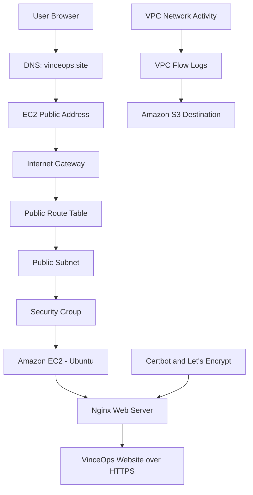

# VinceOps Cloud Network and Secure Web Architecture


## Overview

This document describes the AWS network and web architecture implemented during Month 2 of VinceOps Cloud.

The project established a complete point-in-time deployment path from a custom Amazon VPC to an HTTPS-enabled website hosted on an Ubuntu Amazon EC2 instance and served through Nginx.

The implementation covered:

- custom VPC networking;
- public subnet configuration;
- internet routing;
- EC2 compute deployment;
- SSH administration;
- Nginx installation;
- application-file deployment;
- DNS mapping;
- HTTPS certificate configuration;
- VPC network logging;
- functional validation;
- authorised external port scanning.

The EC2 instance was stopped after the deployment had been tested and the required evidence had been collected to control ongoing laboratory costs.

---

## High-Level Architecture



## Primary Request Path

```text
User Browser
      │
      ▼
vinceops.site
DNS A Record
      │
      ▼
EC2 Public Address
      │
      ▼
Internet Gateway
      │
      ▼
Public Route Table
0.0.0.0/0 → Internet Gateway
      │
      ▼
Public Subnet
      │
      ▼
Security Group
      │
      ▼
Amazon EC2
Ubuntu Linux
      │
      ▼
Nginx
/var/www/html
      │
      ▼
VinceOps Website
HTTPS Enabled
```

## Supporting Logging Path

```text
VPC Network Activity
        │
        ▼
VPC Flow Logs
        │
        ▼
Amazon S3 Destination
```

## TLS Configuration Path

```text
vinceops.site
www.vinceops.site
        │
        ▼
Certbot
        │
        ▼
Let's Encrypt
        │
        ▼
Nginx HTTPS Configuration
```

---

# 1. VPC and Network Foundation

## Objective

Create a dedicated AWS network boundary before launching the web-server workload.

## Implementation

A custom Amazon VPC was used instead of relying on the default AWS VPC.

The implemented network foundation included:

- a custom VPC;
- a public subnet;
- an Internet Gateway;
- a public route table;
- an explicit subnet-to-route-table association;
- security controls;
- VPC Flow Logs;
- an Amazon S3 destination for Flow Log data.

## Component Responsibilities

| Component | Responsibility |
|---|---|
| Custom VPC | Provides the network boundary for the deployment |
| Public subnet | Hosts the internet-facing EC2 instance |
| Internet Gateway | Provides connectivity between the VPC and the internet |
| Route table | Directs public IPv4 traffic to the Internet Gateway |
| Security group | Controls traffic reaching the EC2 instance |
| VPC Flow Logs | Records supported network traffic metadata |
| Amazon S3 | Receives the configured Flow Log output |

---

## Public Subnet

The public subnet was created inside the custom VinceOps VPC using:

```text
10.0.1.0/24
```

The subnet was used to host the internet-facing EC2 web server.

### Evidence

[View public-subnet evidence](./%20screenshots/01-public-subnet-created.png)


---

## Route-Table Association

The public subnet was explicitly associated with the VinceOps route table.

This ensured that the subnet used the intended routing configuration.

### Evidence

[View route-table association](./%20screenshots/02-route-table-subnet-association.png)


---

## Internet Gateway Route

The route table contained an active default IPv4 route:

```text
0.0.0.0/0 → Internet Gateway
```

This route provided the public subnet with an internet path.

### Evidence

[View Internet Gateway route](./%20screenshots/03-public-route-to-internet-gateway.png)


---

## VPC Flow Logs

VPC Flow Logs were enabled to provide network-traffic metadata for troubleshooting and security review.

The Flow Log configuration captured supported traffic metadata and sent the output to the designated Amazon S3 destination.

### Evidence

[View VPC Flow Logs evidence](./%20screenshots/04-vpc-flow-logs-active.png)


---

# 2. EC2 Compute Layer

## Objective

Launch the compute resource used to host the Nginx web server and customized website.

## Instance Baseline

| Setting | Implementation |
|---|---|
| Cloud service | Amazon EC2 |
| Operating system | Ubuntu Linux |
| Instance type | `t2.medium` |
| Root storage | 20 GB |
| Network | Custom VinceOps VPC |
| Subnet | Public subnet |
| Public network interface | Enabled for the lab deployment |
| Administration | SSH key-pair authentication |
| Metadata protection | IMDSv2 |
| Web server | Nginx |

The EC2 instance was attached to the custom VPC, public subnet, and project security controls.

### Evidence

[View EC2 instance evidence](./%20screenshots/05-ec2-instance-summary.png)


---

# 3. Server Administration

## Objective

Connect securely to the Ubuntu EC2 instance and prepare it for the web deployment.

## SSH Access

Key-based SSH authentication was used for remote server administration.

The public evidence was sanitized to remove:

- private-key filenames;
- server addresses;
- local usernames;
- AWS hostnames;
- login information.

### Evidence

[View SSH access evidence](./%20screenshots/06-ssh-access-success.png)


## Server Preparation

The Ubuntu package index was updated before the required software was installed.

```bash
sudo apt update -y
sudo apt upgrade -y
```

---

# 4. Nginx Web-Service Layer

## Objective

Install and operate the web service used to deliver the VinceOps website.

## Installation

Nginx was installed using:

```bash
sudo apt install nginx -y
```

The service was enabled and started:

```bash
sudo systemctl enable nginx
sudo systemctl start nginx
```

The running state was checked using:

```bash
sudo systemctl status nginx
```

A local response test was also performed:

```bash
curl -I http://localhost
```

## Web Root

The website files were served from:

```text
/var/www/html
```

The default Nginx content was replaced by the customized VinceOps website files.

### Evidence

[View Nginx validation evidence](./%20screenshots/07-nginx-active-http-response.png)


---

# 5. Application Deployment

## Objective

Transfer the customized website files to the EC2 server and publish them through Nginx.

## File Transfer

The website files were transferred to the Ubuntu server through an SSH and SFTP workflow using MobaXterm.

A temporary working directory was prepared:

```bash
mkdir webcontent
cd webcontent
```

The uploaded archive was extracted:

```bash
sudo apt install unzip -y
unzip application.zip
ls -la
```

The default Nginx page was removed:

```bash
sudo rm -rf /var/www/html/index*
```

The customized website files were then copied into:

```text
/var/www/html
```

The deployment was tested first through the server endpoint and later through the configured domain.

---

# 6. DNS Layer

## Objective

Connect the human-readable project domain to the EC2-hosted website.

## Domain

The configured project domain was:

```text
vinceops.site
```

A DNS A record was used to point the domain to the public address of the EC2 instance during the deployment.

```text
vinceops.site
      │
      ▼
EC2 Public Address
```

## DNS Validation

DNS propagation was checked across multiple global DNS resolvers before completing HTTPS configuration.

### Evidence

[View DNS propagation evidence](./%20screenshots/08-dns-propagation-vinceops-site.png)


## Architecture Consideration

A standard EC2 public address may change after the instance is stopped and restarted.

For a longer-running implementation, a more stable entry point could include:

- an Elastic IP;
- an Application Load Balancer;
- another managed ingress service.

This project documents the successful point-in-time EC2 deployment that was implemented and tested.

---

# 7. Certbot and TLS Tooling

## Objective

Install the software required to request and deploy a trusted HTTPS certificate.

Certbot and its Nginx integration were installed:

```bash
sudo apt install certbot -y
sudo apt install python3-certbot-nginx -y
```

The Nginx configuration was checked using:

```bash
sudo nginx -t
```

### Evidence

[View Certbot installation evidence](./%20screenshots/9-certbot-installed.png)


---

# 8. HTTPS Certificate Deployment

## Initial Certificate Request

A Let’s Encrypt certificate was requested for the root domain using the Certbot Nginx integration:

```bash
sudo certbot --nginx -d vinceops.site
```

### Evidence

[View certificate-issuance evidence](./%20screenshots/10-certbot-certificate-issued.png)


---

## Root and `www` Coverage

The initial configuration was reviewed and expanded to cover both public hostnames:

```text
vinceops.site
www.vinceops.site
```

The certificate command used was:

```bash
sudo certbot --nginx -d vinceops.site -d www.vinceops.site
```

This prevented certificate-name mismatch problems when the `www` hostname was used.

### Evidence

[View root-and-www certificate evidence](./%20screenshots/11-certificate-expanded-root-and-www.png)


---

## Browser Certificate Validation

Browser certificate inspection confirmed that a Let’s Encrypt certificate had been applied to the VinceOps domain.

### Evidence

[View certificate details](./%20screenshots/12-https-certificate-detail.png)


---

# 9. Website Deployment Result

## Objective

Confirm that the customized website was successfully served through the public HTTPS endpoint.

The completed deployment used:

```text
https://vinceops.site
```

The end-to-end path combined:

- public DNS resolution;
- AWS network routing;
- EC2 compute;
- Nginx web serving;
- Let’s Encrypt TLS encryption;
- customized website content.

### Evidence

[View deployed website evidence](./%20screenshots/13-vinceops-site-https-deployed.png)


---

# 10. Functional Validation

The deployment was validated through:

- domain resolution;
- successful HTTPS loading;
- certificate inspection;
- homepage availability;
- static-content loading;
- Nginx service status;
- local HTTP-response testing;
- access-log review;
- error-log review;
- server-resource checks.

Useful commands included:

```bash
curl -I https://vinceops.site

sudo tail -n 50 /var/log/nginx/access.log
sudo tail -n 50 /var/log/nginx/error.log

df -h
free -m
```

---

# 11. External Security Validation

## Scope

An authorised light external port scan was performed against the self-owned project domain.

The scanner evaluated the top 100 ports. It was used as a first-pass exposure assessment and not as a complete manual penetration test.

## Initial Observation

The initial scan observed:

| Port | Service | State |
|---:|---|---|
| 80 | HTTP | Open |
| 443 | HTTPS | Open |

### Evidence

[View initial scan screenshot](./%20screenshots/14-port-scan-before-http-and-https.png)


[View initial scan report](./%20screenshots/%20security-reports/port-scan-before-http-and-https.png)

---

## Follow-Up Observation

After the public exposure was reviewed and adjusted, the follow-up scan observed:

| Port | Service | State |
|---:|---|---|
| 443 | HTTPS | Open |

[View follow-up scan report](./%20screenshots/%20security-reports/port-scan-after-https-only.png)

## Interpretation

Within the limited scan scope, the publicly observed service exposure was reduced from HTTP and HTTPS to HTTPS only.

The result does not prove that:

- every possible port was tested;
- every other service was closed;
- the website contained no vulnerabilities;
- a complete penetration test had been performed.

Detailed notes are available in:

[Security Testing Documentation](./security-testing.md)

---

# 12. Principal Architecture Decisions

The implementation followed these key decisions:

1. Build the custom network before launching compute.
2. Place the internet-facing server in a dedicated public subnet.
3. Explicitly associate the subnet with the intended route table.
4. Use an Internet Gateway for the public traffic path.
5. Enable VPC Flow Logs for network visibility.
6. Use Amazon S3 as the configured Flow Log destination.
7. Launch an Ubuntu EC2 instance inside the custom network.
8. Use key-based SSH authentication for server administration.
9. Use Nginx to serve the customized website.
10. Map `vinceops.site` to the EC2 service during deployment.
11. Enable HTTPS through Certbot and Let’s Encrypt.
12. Expand certificate coverage to include the root and `www` hostnames.
13. Perform functional and external exposure validation.
14. Stop the EC2 instance after evidence collection to control cost.

Detailed reasoning is documented in:

[Architecture and Technical Decisions](./decisions.md)

---

# 13. Deployment Lifecycle

The EC2-hosted deployment was successfully tested through:

- DNS resolution;
- Nginx service validation;
- HTTPS certificate inspection;
- website functionality checks;
- external port scanning.

After the implementation and evidence collection were completed, the EC2 instance was stopped to control ongoing laboratory costs.

The repository therefore documents a completed point-in-time deployment rather than representing the EC2 workload as a continuously operated production system.

---

# Related Documentation

| Document | Purpose |
|---|---|
| [Month 2 Overview](./README.md) | Recruiter-facing project summary |
| [Technical Decisions](./decisions.md) | Architecture decisions, trade-offs, and improvements |
| [Security Testing](./security-testing.md) | Scan scope, findings, and remediation notes |
| [Serverless Bonus](./serverless-bonus.md) | Additional serverless hosting exercise |
| [Evidence Register](./%20screenshots/README.md) | Sanitized implementation evidence |

---

# Outcome

The Month 2 implementation demonstrated:

- custom AWS network design;
- public-subnet configuration;
- intentional internet routing;
- EC2 compute deployment;
- key-based server administration;
- Nginx web hosting;
- DNS configuration;
- trusted TLS encryption;
- VPC traffic logging;
- functional application validation;
- evidence-led external exposure review;
- cost-conscious resource lifecycle management.

---

## Navigation

[Back to Month 2 Overview](./README.md) ·
[Technical Decisions](./decisions.md) ·
[Security Testing](./security-testing.md) ·
[Serverless Bonus](./serverless-bonus.md) ·
[Evidence](./%20screenshots/README.md)
