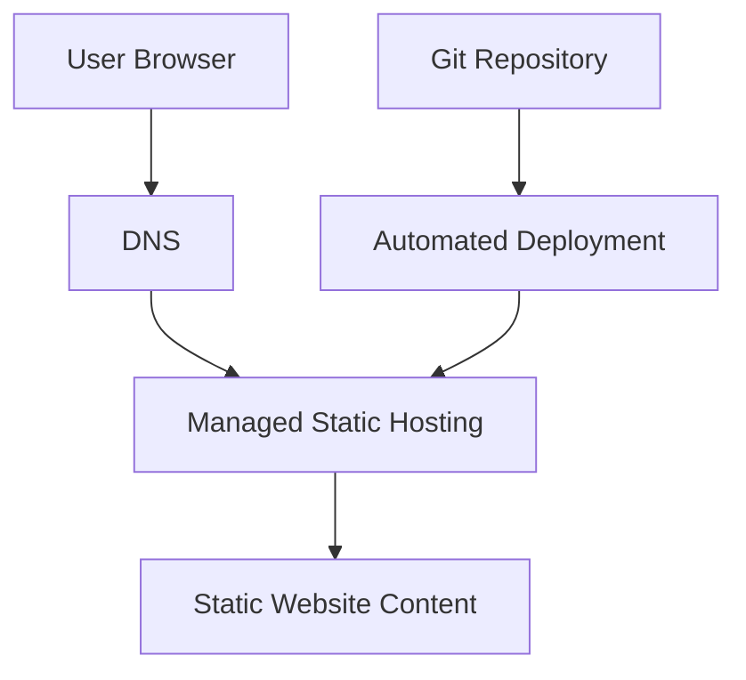

# Bonus Exercise: Serverless Website Hosting


## Overview

As an additional Month 2 exercise, I explored a serverless approach to hosting static website content.

This exercise was completed separately from the primary VinceOps Cloud deployment.

The main Month 2 architecture used:

```text
Custom Amazon VPC
        │
        ▼
Public Subnet
        │
        ▼
Amazon EC2
        │
        ▼
Ubuntu Linux
        │
        ▼
Nginx
        │
        ▼
HTTPS Website
```

The serverless exercise explored an alternative model in which static website content can be delivered without directly administering an EC2 operating system and Nginx web server.

---

## Purpose of the Exercise

The objective was to compare two website-hosting approaches:

1. A manually administered EC2 and Nginx deployment.
2. A managed or serverless static-hosting approach.

The exercise helped demonstrate the architectural difference between:

- managing virtual-machine infrastructure; and
- using a managed platform to publish static website content.

---

## Primary EC2 Deployment

The primary Month 2 implementation required direct administration of the following components:

- custom Amazon VPC;
- public subnet;
- Internet Gateway;
- route table;
- security group;
- Amazon EC2 instance;
- Ubuntu operating system;
- SSH access;
- Nginx installation;
- website-file deployment;
- Certbot installation;
- Let’s Encrypt certificate configuration;
- operating-system maintenance;
- external exposure validation.

The primary request path was:

```text
User
  │
  ▼
DNS
  │
  ▼
Internet Gateway
  │
  ▼
Public Subnet
  │
  ▼
Amazon EC2
  │
  ▼
Nginx
  │
  ▼
Website
```

This approach provided practical experience with networking, Linux administration, web-server configuration, DNS, HTTPS, logging, and security testing.

---

## Serverless Hosting Concept

In a serverless static-hosting model, the hosting platform manages much of the underlying infrastructure.

A simplified path is:

```text
User Browser
      │
      ▼
Managed Hosting Endpoint
      │
      ▼
Static Website Files
```

The platform may manage responsibilities such as:

- infrastructure provisioning;
- underlying server availability;
- content delivery;
- scaling;
- platform maintenance;
- managed deployment endpoints.

The exact features depend on the selected hosting platform and its configuration.

---

## Architectural Comparison

| Area | EC2 and Nginx Deployment | Serverless Static Hosting |
|---|---|---|
| Server administration | Administrator manages the server | Hosting platform manages underlying servers |
| Operating system | Ubuntu required | No direct operating-system administration |
| SSH access | Used for deployment and management | Normally not required for static hosting |
| Web server | Nginx installed and configured | Managed by the hosting platform |
| Scaling | Requires architecture planning | Usually managed by the platform |
| Patching | Administrator responsibility | Underlying platform managed by provider |
| Deployment | Files copied to EC2 web root | Files uploaded or deployed to managed hosting |
| Network design | Custom VPC and public subnet used | Platform-specific network path |
| Troubleshooting | Server, Nginx and network logs | Platform deployment and access logs |
| Learning focus | Infrastructure and Linux operations | Managed deployment and hosting workflow |

---

## Why the Serverless Exercise Was Kept Separate

The serverless exercise is not included in the primary EC2 architecture diagram because the two deployments use different hosting models.

The primary project demonstrates:

- AWS network construction;
- EC2 deployment;
- Linux administration;
- Nginx operation;
- DNS configuration;
- HTTPS certificate management;
- network logging;
- external security review.

The serverless exercise demonstrates an alternative approach that reduces direct server-management responsibilities.

Combining both approaches into one architecture diagram would incorrectly suggest that the serverless hosting platform formed part of the EC2 request path.

---

## Benefits Observed

The serverless approach introduced several potential benefits for static website hosting:

- reduced direct infrastructure administration;
- no requirement to maintain an EC2 operating system;
- no requirement to install and operate Nginx manually;
- simpler website publishing workflow;
- reduced server-patching responsibility;
- easier scaling for static content;
- lower operational complexity for simple websites.

---

## Trade-Offs

A managed hosting approach also introduces trade-offs:

- less direct control over the underlying server;
- platform-specific deployment processes;
- possible provider limitations;
- reduced access to operating-system configuration;
- platform-specific logging and troubleshooting;
- possible migration effort when changing providers;
- service limits and pricing considerations.

The most suitable hosting approach depends on the application’s requirements.

---

## When EC2 May Be More Appropriate

An EC2-based deployment may be suitable when the workload requires:

- direct operating-system access;
- custom Nginx configuration;
- background services;
- specialised packages;
- custom networking;
- detailed server-level control;
- applications that cannot run as static content;
- direct access to server logs and processes.

---

## When Serverless Static Hosting May Be More Appropriate

A managed static-hosting approach may be suitable when the website:

- consists mainly of HTML, CSS and JavaScript;
- does not require a continuously running application server;
- does not require direct operating-system access;
- benefits from simplified deployment;
- requires low infrastructure-maintenance overhead;
- can operate within the selected platform’s limitations.

---

## Evidence Boundary

The repository currently retains detailed implementation evidence for the primary EC2 deployment.

That evidence includes:

- AWS network configuration;
- EC2 deployment;
- SSH access;
- Nginx operation;
- DNS propagation;
- Certbot installation;
- HTTPS certificate deployment;
- successful website loading;
- external port scanning.

The current repository does not retain equivalent platform-specific screenshots for the serverless exercise.

Therefore, this document does not claim that the serverless exercise included:

- a particular named hosting provider;
- a custom domain;
- custom DNS configuration;
- CDN configuration;
- Web Application Firewall protection;
- serverless functions;
- automated CI/CD;
- managed TLS configuration;
- production availability;
- performance or security testing.

The serverless work is presented only as a supplementary hosting exercise.

---

## Current Status

```text
Exercise type: Supplementary serverless hosting exploration
Relationship to main project: Separate
Primary Month 2 architecture: EC2 and Nginx
Platform-specific evidence retained: No
Production claim: No
```

---

## Future Improvement

A future serverless milestone could include complete evidence for:

1. the selected hosting platform;
2. website-file deployment;
3. deployment status;
4. managed endpoint;
5. custom-domain configuration;
6. DNS validation;
7. HTTPS certificate status;
8. deployment logs;
9. cache or CDN behaviour;
10. security configuration;
11. cost comparison;
12. teardown or lifecycle management.

A future architecture could resemble:



This should only be added to the portfolio after the implementation and evidence have been retained.

---

## Learning Outcome

This exercise highlighted that a website can be hosted through different operational models.

The EC2 deployment provided experience with:

- infrastructure configuration;
- Linux server administration;
- Nginx;
- networking;
- DNS;
- HTTPS;
- logging;
- security validation.

The serverless exercise introduced the alternative concept of delivering static website content while transferring more infrastructure responsibility to a managed hosting platform.

Both approaches are useful, but they solve different operational requirements.

---

## Related Documentation

| Document | Purpose |
|---|---|
| [Month 2 Overview](./README.md) | Main project summary |
| [Network and Web Architecture](./network-web-architecture.md) | Primary EC2 deployment architecture |
| [Architecture Decisions](./decisions.md) | Technical decisions and trade-offs |
| [Security Testing](./security-testing.md) | External exposure review |
| [Evidence Register](./%20screenshots/README.md) | Sanitized primary-deployment evidence |

---

## Navigation

[Back to Month 2 Overview](./README.md) ·
[Architecture](./network-web-architecture.md) ·
[Decisions](./decisions.md) ·
[Security Testing](./security-testing.md) ·
[Evidence](./%20screenshots/README.md)
